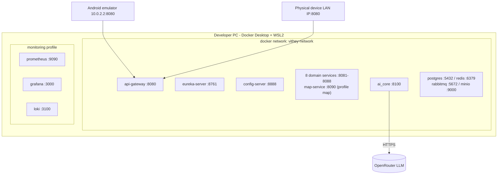
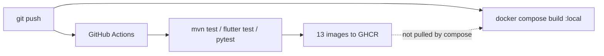

# Deployment Architecture

> Status: Verified · Last reviewed: 2026-09-30
> Evidence: `backend/docker-compose.yml`, `backend/docker-compose.demo.yml`, `backend/scripts/*.ps1`, `backend/infrastructure/config-repo/*.yml`, `monitoring/docker-compose.yml`

Part of the Vithey documentation set · Master index: [`../00-project-overview/07-document-index.md`](../00-project-overview/07-document-index.md) · [Environment setup](02-environment-setup.md) · [Development deployment](03-development-deployment.md) · [Deployment checklist](06-deployment-checklist.md)

## 1. Environments that exist

| Environment | Status | Host |
|---|---|---|
| Local development | Local development (verified) | developer PC (host-run JVMs or Docker) |
| Local demo (Profile M) | Local demo (verified) | single developer PC (Docker Desktop + WSL2) |
| Staging | Staging (does not exist) | — |
| Production | Production (does not exist) | — |

[VERIFIED — `EVIDENCE-BASIS.md` §12; no deploy workflows, no K8s/Helm/Terraform/Jenkins]

**Staging and production are not deployed.** No documentation may describe them as running. This section covers the two verified local environments and labels any future design as a recommendation.

## 2. Local demo topology (Profile M)

[VERIFIED — `backend/docker-compose.yml`, `backend/docker-compose.demo.yml`, `monitoring/docker-compose.yml`]

## 3. Deployment options (all local)

| Option | Entry point | Description |
|---|---|---|
| Full Java stack | `backend/scripts/docker-up.ps1` | all Java services + infra + ai_core; no `map-service` |
| Profile M demo | `backend/scripts/docker-up-demo.ps1` | base + demo overlay; env caps; map opt-in |
| Host-run dev | `backend/scripts/start-dev-host.ps1` | infra in Docker, selected JVMs on host |
| All-in-one script | `backend/scripts/start-all.ps1` | full stack with health waits |
| One service | `backend/scripts/docker-build-service.ps1` | single service against shared infra |

[VERIFIED — `backend/scripts/`]

## 4. Release artefact flow

Compose files build and use **local** images (`vithey-<svc>:local`); they do not pull GHCR images. No automation consumes the published images. [VERIFIED — `backend/docker-compose.yml`, `ci-promote-dev.yml`]

## 5. Configuration model

- Runtime config is served by `config-server` from `backend/infrastructure/config-repo/*.yml` (native profile). In compose it is bind-mounted read-only; in an image deployment it is baked in and requires a rebuild. [VERIFIED]
- Environment-specific overrides are environment variables (see [Environment configuration](../13-devops/04-environment-configuration.md)).
- `application-prod.yml` exists but is not activated anywhere. [VERIFIED]

## 6. Recommended Production Architecture (recommendation — not current state)

> **This subsection is a recommendation only. Production is not deployed.** It is provided as a design starting point and must not be read as an existing environment.

A future production topology would need, at minimum: a managed PostgreSQL (one DB per service), managed Redis/RabbitMQ or containers, object storage for MinIO, an image registry pull policy pinned to `sha-<short>`, a reverse proxy with TLS in front of `api-gateway` only, the monitoring profile running persistently, `SPRING_PROFILES_ACTIVE=prod` with secrets injected from a secret manager, and non-root containers (note `ai_core` currently runs as root). This is `[PLANNED]`/recommendation — no such environment exists. [INFERRED]

## 7. Known deployment constraints

- Flutter web/Chrome unsupported (Isar, secure storage, camera). [VERIFIED]
- Android emulator reaches host via `10.0.2.2`; physical devices need the PC LAN IP. [VERIFIED]
- Third-party images use floating `latest` tags — a reproducibility risk. [VERIFIED]

[TBD] Any target hosting provider, domain, TLS certificate authority or budget — TBD — Requires confirmation.
