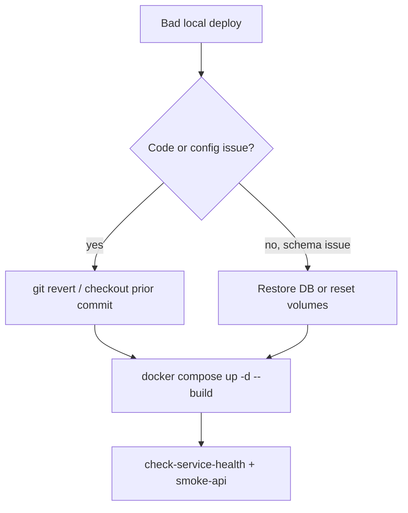

# Rollback Plan

> Status: Verified (local) · Last reviewed: 2026-09-30
> Evidence: `backend/scripts/*.ps1`, `.github/workflows/ci-promote-dev.yml`, `.github/workflows/*-service-ci.yml`, `EVIDENCE-BASIS.md` §1 (git tags)

Part of the Vithey documentation set · Master index: [`../00-project-overview/07-document-index.md`](../00-project-overview/07-document-index.md) · [Deployment checklist](06-deployment-checklist.md) · [Disaster recovery](08-disaster-recovery.md) · [Release process](../13-devops/08-release-process.md)

## 1. Scope

There is **no automated rollback** anywhere. No deploy pipeline exists to roll back, and no workflow reverts images or code. [VERIFIED — no rollback job in any workflow]

This plan therefore covers **local recovery**: reverting code, rebuilds, images and data in the verified local environments.

## 2. Rollback levers available

| Lever | How | Evidence |
|---|---|---|
| Git revert | `git revert <sha>` then push (CI re-tests, re-promotes) | `.github/workflows/ci-promote-dev.yml` |
| Image tag rollback | pull a previously pushed `sha-<short>` GHCR tag | `ci-promote-dev.yml` tags |
| Local image rebuild | `docker compose ... up -d --build` after checking out a prior commit | compose files |
| Config rollback | revert `config-repo` change + rebuild config-server image | `docker-compose.yml:128-130` |
| Data rollback | restore Postgres from a dump/volume snapshot (manual) | see [Backup/restore](../16-operations/05-backup-restore.md) |
| Full reset | `docker-down-demo.ps1 -v` wipes volumes (destructive) | `docker-down-demo.ps1` |

## 3. Code rollback (fast-forward reversal)

Because promotion is a fast-forward of a single SHA, rolling the `dev` branch back is a force-update or a revert:

```powershell
# identify the last good commit
git log --oneline -10
# safe: create a revert commit and let CI re-test
git revert <bad-sha>
git push origin kimheang      # CI re-runs and re-promotes
```

> Do not force-push to shared branches unless explicitly authorised. Prefer a revert commit. [VERIFIED — repository conventions; `AGENTS.md`]

## 4. Image rollback (only meaningful once something deploys images)

Images carry immutable `sha-<short>` tags, so a prior build can be re-pulled:

```powershell
docker pull ghcr.io/<owner>/vithey-auth-service:sha-<good-short>
```

Local compose uses `:local` tags, so local rollback means checking out the prior commit and rebuilding. Nothing currently consumes the published `sha-*` tags in an environment. [VERIFIED]

## 5. Database rollback (local)

Flyway migrations run on service start. **Never edit an already-applied migration** (checksum mismatch). To roll back schema changes:

```powershell
# destructive: wipes all volumes and databases
cd backend
.\scripts\docker-down-demo.ps1 -v
.\scripts\docker-up-demo.ps1
```

For a non-destructive restore, use `pg_dump`/`pg_restore` (see [Backup/restore](../16-operations/05-backup-restore.md)). [VERIFIED]

> Known data defect: `career-service` has two migrations numbered `V3`. Flyway will fail on a fresh apply; resetting volumes and fixing versioning is required. [VERIFIED — `EVIDENCE-BASIS.md` §8]

## 6. Rollback decision flow (local)



[VERIFIED — derived from scripts]

## 7. Verification after rollback

```powershell
cd backend
.\scripts\check-service-health.ps1
.\scripts\verify-docker.ps1
.\scripts\smoke-api.ps1
```

[VERIFIED]

## 8. Gaps

| Gap | Status |
|---|---|
| Automated rollback / blue-green / canary | Not implemented |
| Environment to roll back | Staging and production do not exist |
| Database migration down-migrations | Not implemented (Flyway forward-only here) |
| Rollback runbook owning team | TBD — Requires confirmation. |

[VERIFIED unless marked]
