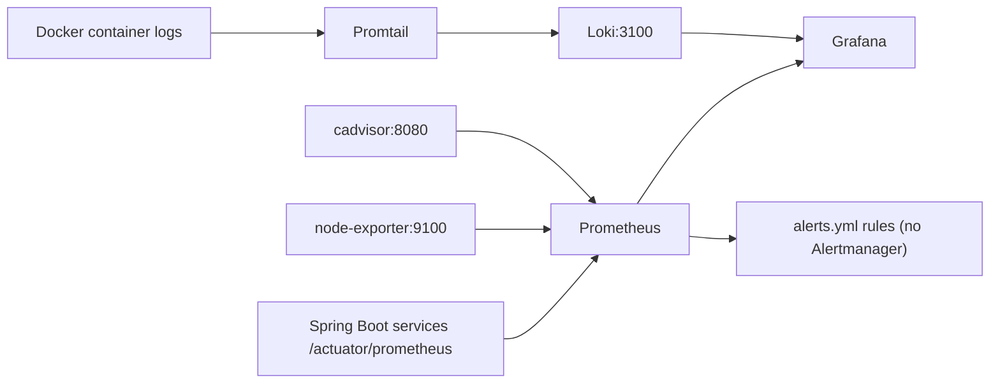

# Monitoring Overview

> Status: Verified · Last reviewed: 2026-09-30
> Evidence: `monitoring/docker-compose.yml`, `monitoring/prometheus/prometheus.yml`, `monitoring/prometheus/alerts.yml`, `monitoring/loki/loki-config.yml`, `monitoring/promtail/promtail-config.yml`, `monitoring/grafana/`, `monitoring/README.md`

Part of the Vithey documentation set · Master index: [`../00-project-overview/07-document-index.md`](../00-project-overview/07-document-index.md) · [Prometheus](02-prometheus.md) · [Grafana](03-grafana.md) · [Loki logging](04-loki-logging.md) · [Alerting](05-alerting.md) · [Health checks](06-health-checks.md)

## 1. What exists

A Docker Compose observability stack under `monitoring/`, opt-in via the `monitoring` profile.

| Component | Image | Port | Purpose |
|---|---|---|---|
| Prometheus | `prom/prometheus` | 9090 | metrics + rule evaluation |
| Grafana | `grafana/grafana` | 3000 | dashboards + log search |
| Loki | `grafana/loki` | 3100 | log storage |
| Promtail | `grafana/promtail` | — | Docker log collection → Loki |
| node-exporter | `prom/node-exporter` | 9100 | host CPU/RAM/disk/network |
| cAdvisor | `gcr.io/cadvisor/cadvisor` | 8095 (host) | container CPU/memory |

[VERIFIED — `monitoring/docker-compose.yml`]

## 2. Profile gating

Every service in `monitoring/docker-compose.yml` declares `profiles: ["monitoring"]`, so a plain `docker compose up` in `monitoring/` starts nothing. Start explicitly:

```powershell
cd monitoring
Copy-Item .env.example .env
docker compose --profile monitoring up -d
```

The stack attaches to the external `vithey-network`, so the backend stack must exist first. [VERIFIED — `monitoring/docker-compose.yml`, `README.md`]

## 3. Topology



[VERIFIED]

## 4. Coverage and gaps

| Topic | Status |
|---|---|
| Metrics scrape for Spring Boot services | Implemented (`/actuator/prometheus`) |
| Host metrics (node-exporter) | Implemented |
| Container metrics (cAdvisor) | Implemented |
| Log aggregation (Promtail → Loki) | Implemented |
| Dashboards provisioned as code | Implemented |
| **Alertmanager / notifications** | **Not implemented** — alerts visible in the Prometheus UI only |
| ai_core Prometheus metrics | Not implemented (`/health` only) |
| Tracing (Tempo/Jaeger/OTel) | Not implemented |
| Synthetic/uptime monitoring | Not implemented |

[VERIFIED — `alerts.yml`, `prometheus.yml` has no `alerting:` block; `ai_core` has `/health` but no micrometer registry]

> `monitoring/prometheus/prometheus.yml` defines **nine** microservice scrape jobs (api-gateway, auth, user-profile, file, content, career, finance, chat, notification); the `../_meta/EVIDENCE-BASIS.md` baseline was corrected to nine on 2026-09-30. The file is authoritative. [VERIFIED — `prometheus.yml:24-76`]

## 5. Documentation map

- Scrape config & targets: [02-prometheus.md](02-prometheus.md)
- Dashboards & datasources: [03-grafana.md](03-grafana.md)
- Logs & retention: [04-loki-logging.md](04-loki-logging.md)
- Rules & the missing Alertmanager: [05-alerting.md](05-alerting.md)
- Health endpoints & scripts: [06-health-checks.md](06-health-checks.md)
- Handling failures: [07-incident-response.md](07-incident-response.md)

[TBD] Whether Alertmanager, tracing, or an on-call notification channel is required — TBD — Requires confirmation.
