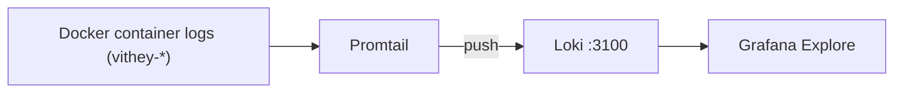

# Loki Logging

> Status: Verified · Last reviewed: 2026-09-30
> Evidence: `monitoring/loki/loki-config.yml`, `monitoring/promtail/promtail-config.yml`, `monitoring/docker-compose.yml`, `monitoring/grafana/provisioning/datasources/datasource.yml`, `monitoring/README.md`

Part of the Vithey documentation set · Master index: [`../00-project-overview/07-document-index.md`](../00-project-overview/07-document-index.md) · [Monitoring overview](01-monitoring-overview.md) · [Grafana](03-grafana.md) · [Alerting](05-alerting.md)

## 1. Architecture



Promtail tails Docker container logs via the Docker socket and pushes to Loki. [VERIFIED — `promtail-config.yml`]

## 2. Loki configuration

| Setting | Value |
|---|---|
| HTTP port | 3100 |
| Auth | disabled (`auth_enabled: false`) |
| Storage | filesystem (`/loki/chunks`, `/loki/rules`) |
| Replication factor | 1 |
| Schema | TSDB, schema `v13`, index period 24h |
| **Retention** | **168h (7 days)** |
| Compactor | enabled; `retention_enabled: true`, `retention_delete_delay: 2h` |
| Analytics reporting | disabled |

[VERIFIED — `monitoring/loki/loki-config.yml`]

Data is stored in the `vithey-loki-data` volume. [VERIFIED — `monitoring/docker-compose.yml`]

## 3. Promtail configuration

- `docker_sd_configs` against `unix:///var/run/docker.sock`, refresh 5s.
- Relabel rules:
  - `container` ← container name.
  - `service` ← container name with the `vithey-` prefix stripped (e.g. `vithey-auth-service` → `auth-service`).
  - `stream` ← stdout/stderr.
  - `container_id`.
- Pipeline: Docker JSON parsing, then a regex stage flagging lines matching `(?i)(error|exception|failed)` with label `level=error`.

[VERIFIED — `monitoring/promtail/promtail-config.yml`]

Promtail itself exposes metrics on port 9080 but is not published to the host in compose. [VERIFIED]

## 4. Querying

In Grafana **Explore** with the Loki datasource:

```logql
{service="auth-service"}
{service="chat-service"} |= "ERROR"
{service=~"api-gateway|auth-service"}
{service="notification-service"} | json
```

[VERIFIED — `monitoring/README.md`]

## 5. Retention and capacity

Logs are retained for **7 days** and then compacted away. There is no long-term log archive and no S3/object-store backend. [VERIFIED]

## 6. Operations

```powershell
cd monitoring
docker compose --profile monitoring up -d loki promtail
docker compose --profile monitoring restart loki
docker compose --profile monitoring logs -f promtail
```

[VERIFIED]

## 7. Troubleshooting

| Symptom | Likely cause | Fix |
|---|---|---|
| No logs in Loki | Promtail lacks Docker socket access | verify the bind mount `/var/run/docker.sock` |
| Logs for one service missing | container name not prefixed `vithey-` | ensure the container follows the naming convention |
| Old logs gone | retention 168h | expected; no archive |
| Only some services appear | those containers not running | start the backend stack |

[VERIFIED — `monitoring/README.md`]

## 8. Gaps

- No log-based alert rules (Loki ruler not configured). [VERIFIED]
- No log redaction pipeline (ensure no secrets are logged; note `VITHEY_MAIL_MODE=log` prints reset tokens to auth-service logs). [VERIFIED — `auth-service/.env.example` comment]
- No centralized retention beyond 7 days. [VERIFIED]
