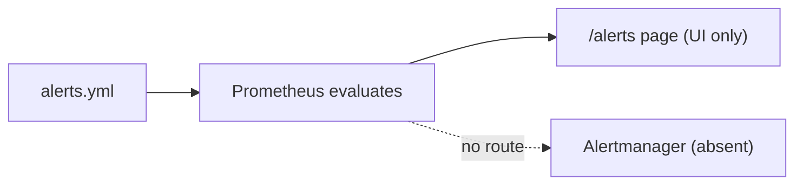

# Alerting

> Status: Verified (rules only; no routing) · Last reviewed: 2026-09-30
> Evidence: `monitoring/prometheus/alerts.yml`, `monitoring/prometheus/prometheus.yml`, `monitoring/docker-compose.yml`

Part of the Vithey documentation set · Master index: [`../00-project-overview/07-document-index.md`](../00-project-overview/07-document-index.md) · [Monitoring overview](01-monitoring-overview.md) · [Prometheus](02-prometheus.md) · [Incident response](07-incident-response.md)

## 1. Key fact: no Alertmanager

Alert rules are defined and evaluated by Prometheus, but there is **no Alertmanager** configured or deployed. Consequences:

- Alerts fire **only in the Prometheus UI** (`http://localhost:9090/alerts`).
- **Nobody is notified** — no email, Slack, PagerDuty, or webhook.
- There is no silencing, grouping, inhibition, or escalation.

[VERIFIED — `prometheus.yml` has no `alerting:` section; no `alertmanager` service in `monitoring/docker-compose.yml`]

## 2. Defined alert rules

`monitoring/prometheus/alerts.yml` (loaded via `rule_files`):

### Group `vithey-service-alerts`

| Alert | Expression (summary) | For | Severity |
|---|---|---|---|
| `ServiceDown` | `up{job=~"api-gateway|auth-service|...|notification-service"} == 0` | 1m | critical |
| `HighHttp5xxRate` | 5xx ratio `> 0.05` by `application` (5m window) | 5m | warning |
| `DatabaseConnectionsHigh` | `hikaricp_connections_active / hikaricp_connections_max > 0.85` (5m) | 5m | warning |

### Group `vithey-infrastructure-alerts`

| Alert | Expression (summary) | For | Severity |
|---|---|---|---|
| `HighCpuUsage` | `100 - avg(rate(node_cpu_seconds_total{mode="idle"}[5m]))*100 > 80` | 5m | warning |
| `HighMemoryUsage` | `(1 - node_memory_MemAvailable_bytes/node_memory_MemTotal_bytes)*100 > 85` | 5m | warning |

[VERIFIED — `monitoring/prometheus/alerts.yml`]

Note `ServiceDown` matches the 9 Spring Boot jobs; it does **not** cover `map-service`, `eureka`, `config` or `ai_core` (not scraped). [VERIFIED]

## 3. Where alerts appear



[VERIFIED]

## 4. Effective monitoring practice today

Because nothing is routed, a human must actively look at the Prometheus Alerts tab or Grafana. In practice the operational health signal is the health-check scripts:

```powershell
cd backend
.\scripts\check-service-health.ps1
.\scripts\verify-docker.ps1
```

See [Health checks](06-health-checks.md) and [Incident response](07-incident-response.md).

## 5. If notifications are later required (recommendation — not current state)

> Recommendation only. No alert routing exists.

Adding an Alertmanager service to `monitoring/docker-compose.yml` (under the `monitoring` profile), wiring `alerting: alertmanagers:` in `prometheus.yml`, and defining receivers (email/Slack) would enable notifications. This is `[PLANNED]` and not implemented. [INFERRED]

[TBD] Required alert notification channels, severity policy and on-call rota — TBD — Requires confirmation.
