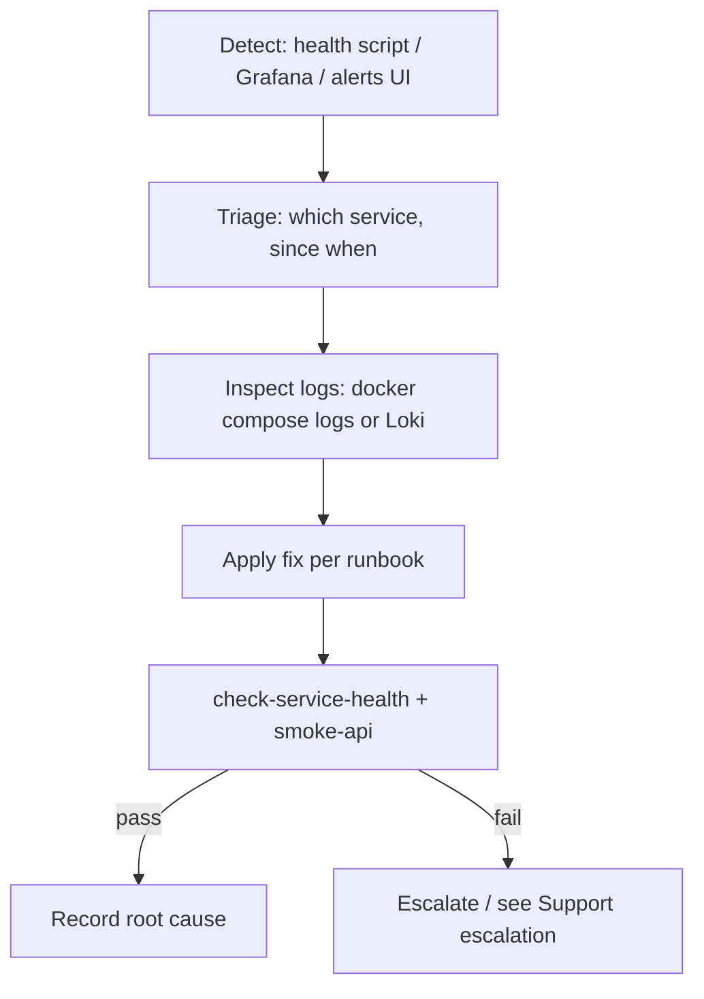

# Incident Response

> Status: Verified (local, manual) · Last reviewed: 2026-09-30
> Evidence: `monitoring/alerts.yml`, `backend/scripts/check-service-health.ps1`, `backend/scripts/docker-down-demo.ps1`, `monitoring/README.md`, `EVIDENCE-BASIS.md` §12

Part of the Vithey documentation set · Master index: [`../00-project-overview/07-document-index.md`](../00-project-overview/07-document-index.md) · [Monitoring overview](01-monitoring-overview.md) · [Alerting](05-alerting.md) · [Troubleshooting](../16-operations/04-troubleshooting.md) · [Support escalation](../16-operations/07-support-escalation.md)

## 1. Context

There is **no formal incident management process**, no on-call rotation and **no alert routing** (no Alertmanager). Detection is manual: a developer sees a failing health check, a Grafana panel, or the Prometheus Alerts tab. This document is a pragmatic local runbook, not an enterprise incident process. [VERIFIED]

## 2. Detection

| Signal | Where |
|---|---|
| Service down / unhealthy | `.\scripts\check-service-health.ps1`, `.\scripts\verify-docker.ps1` |
| Scrape target DOWN | `http://localhost:9090/targets` |
| Firing rules (UI only) | `http://localhost:9090/alerts` |
| Errors in logs | Grafana Explore → Loki, or `docker compose logs` |
| Failed API smoke | `.\scripts\smoke-api.ps1` |

[VERIFIED]

## 3. Severity model (proposed — not formalised)

> Proposed for local triage only. Not an official policy. [INFERRED]

| Severity | Meaning | Example |
|---|---|---|
| S1 | Whole stack unusable | gateway down, Postgres down, all services down |
| S2 | A major feature broken | auth/finance/chat service down |
| S3 | Degraded / partial | one service 5xx, ai_core `degraded`, map missing |
| S4 | Cosmetic / non-blocking | dashboard panel empty |

## 4. Response flow



[VERIFIED — derived from scripts and monitoring README]

## 5. First-response commands

```powershell
cd backend

# who is unhealthy?
.\scripts\check-service-health.ps1
.\scripts\verify-docker.ps1

# inspect a service
docker compose -f docker-compose.yml -f docker-compose.demo.yml ps
docker compose -f docker-compose.yml -f docker-compose.demo.yml logs --tail=200 <service>

# restart one service
docker compose -f docker-compose.yml -f docker-compose.demo.yml restart <service>

# full restart (keeps data)
.\scripts\docker-down-demo.ps1
.\scripts\docker-up-demo.ps1
```

[VERIFIED — `backend/scripts/`]

## 6. Common incidents and first actions

| Incident | First action | Detail |
|---|---|---|
| Gateway down | check Redis + config-server health; restart gateway | [Troubleshooting](../16-operations/04-troubleshooting.md) |
| Service `DOWN` on DB validate | inspect Flyway/entity mismatch; reset volumes as last resort | [Rollback plan](../14-deployment/07-rollback-plan.md) |
| ai_core degraded | verify `DEEPSEEK_API_KEY` | [Loki logging](04-loki-logging.md) |
| Stack will not start | free ports 8080-8100, 15432, 16379, 5672 | `verify-docker.ps1` |
| Port exhaustion / RAM | `set-docker-limits.ps1`, reduce heap knobs | [Start/stop system](../16-operations/02-start-stop-system.md) |
| Config change broke a service | revert `config-repo`, rebuild config-server | same |

## 7. Communication and escalation

There is no incident channel, pager or defined on-call. Escalation is ad-hoc to the project lead. Formal support/escalation is **`TBD — Requires confirmation.`** [VERIFIED — no evidence]

## 8. Post-incident

- Record the affected service, timeline, root cause and the fix in the team's issue tracker.
- If the incident revealed a monitoring gap (e.g. ai_core has no metrics/alerting), note it.
- No post-incident review process is formally defined. [TBD]

[TBD] Formal incident severity policy, notification channels, on-call rota and post-mortem process — TBD — Requires confirmation.
