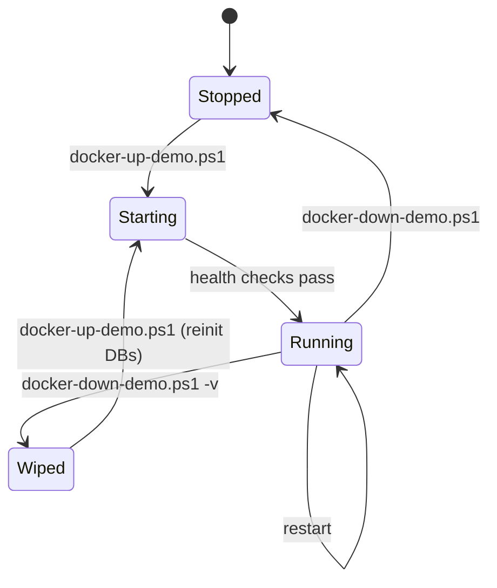

# Start / Stop System

> Status: Verified · Last reviewed: 2026-09-30
> Evidence: `backend/scripts/docker-up-demo.ps1`, `docker-down-demo.ps1`, `docker-up.ps1`, `docker-down.ps1`, `start-all.ps1`, `start-dev-host.ps1`, `docker-build-service.ps1`, `backend/DOCKER.md`

Part of the Vithey documentation set · Master index: [`../00-project-overview/07-document-index.md`](../00-project-overview/07-document-index.md) · [Operation manual](01-operation-manual.md) · [Health check](03-health-check.md) · [Development deployment](../14-deployment/03-development-deployment.md)

## 1. Start commands (from `backend/`)

| Command | Starts | Notes |
|---|---|---|
| `.\scripts\docker-up-demo.ps1` | base + demo overlay: infra, platform, 8 services, gateway, ai_core | recommended; requires `ai_core/.env` |
| `.\scripts\docker-up-demo.ps1 -Profiles map` | above + map-service | needs `GOOGLE_PLACES_API_KEY` for real Places data |
| `.\scripts\docker-up-demo.ps1 -Services a,b,c` | only listed services + their infra deps | others return 503 at gateway |
| `.\scripts\docker-up.ps1` | full Java stack + infra + ai_core | no demo caps, no map |
| `.\scripts\start-all.ps1` | full stack, waits for health, prints status | no demo caps |
| `.\scripts\start-all.ps1 -InfraOnly` | infra only | from `infrastructure/` |
| `.\scripts\start-dev-host.ps1` | infra in Docker + selected JVMs on host | fastest iteration |

[VERIFIED — scripts]

### Subset mode detail

`docker-up-demo.ps1 -Services` builds `docker compose ... up -d --build <services>`. Compose only starts listed services and their declared dependencies. Gateway routes for anything not running return `503`. [VERIFIED — `docker-up-demo.ps1`, `DOCKER.md`]

### Host-run dev detail

`start-dev-host.ps1` starts `postgres, redis, rabbitmq, minio, eureka-server, config-server` in Docker, then launches each requested service in its own PowerShell window via `mvn spring-boot:run`. Default services: `auth-service,user-profile-service,api-gateway`; default heap `160m`. Close a window to stop that service. [VERIFIED]

## 2. Stop commands

| Command | Effect |
|---|---|
| `.\scripts\docker-down-demo.ps1` | stops demo stack, **keeps volumes** |
| `.\scripts\docker-down-demo.ps1 -v` | stops and **removes volumes** (wipes DBs) |
| `.\scripts\docker-down-demo.ps1 -Profiles map` | include map profile |
| `.\scripts\docker-down.ps1` | stops base full stack |
| `.\scripts\start-all.ps1 -Down` | stops full stack |
| `.\scripts\start-dev-host.ps1 -Down` | stops host-dev infra containers |

[VERIFIED — scripts]

> `-v` deletes named volumes `vithey-postgres-data`, `vithey-redis-data`, `vithey-rabbitmq-data`, `vithey-minio-data`. Use it for Flyway checksum recovery or a deliberate reset only. [VERIFIED]

## 3. Restart and single-service control

```powershell
cd backend

# restart one service (compose)
docker compose -f docker-compose.yml -f docker-compose.demo.yml restart auth-service

# stop one service
docker compose -f docker-compose.yml -f docker-compose.demo.yml stop auth-service

# rebuild and recreate one service
docker compose -f docker-compose.yml -f docker-compose.demo.yml up -d --build auth-service
```

[VERIFIED — compose semantics]

## 4. Lifecycle ordering

Services start in dependency order via `depends_on: condition: service_healthy`: Postgres → platform (eureka → config) → services. `start-all.ps1` additionally waits for eureka (up to ~3 min), config (~3 min) and gateway (~6 min) health before printing status. [VERIFIED]

## 5. State diagram



[VERIFIED — derived from scripts]

## 6. Post-start verification

```powershell
.\scripts\check-service-health.ps1
.\scripts\verify-docker.ps1
```

See [Health check](03-health-check.md). [VERIFIED]

## 7. Notes

- Clean stale containers from the retired Java `ai-service`: `docker compose -f docker-compose.yml -f docker-compose.demo.yml down --remove-orphans`. [VERIFIED — `DOCKER.md`]
- If `vithey-network` was created by `infrastructure/` compose, the full stack reuses it (same name/driver). [VERIFIED]
