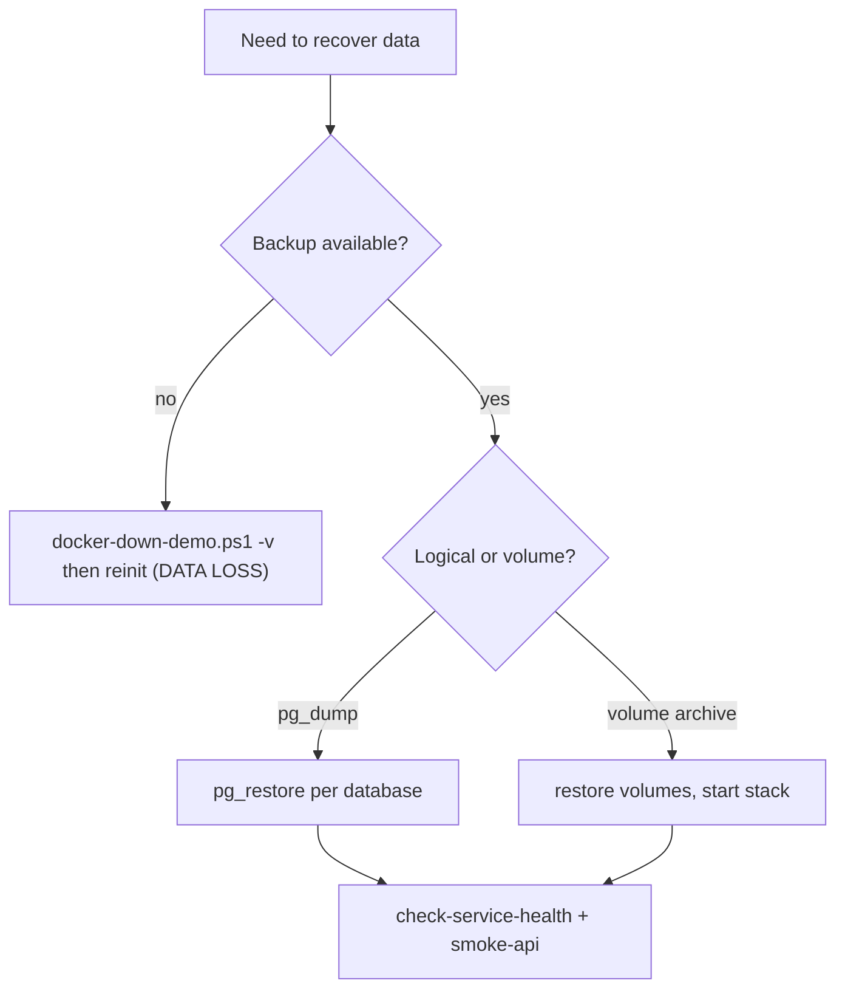

# Backup & Restore

> Status: Verified (no automated backup exists) · Last reviewed: 2026-09-30
> Evidence: `backend/docker-compose.yml` (volumes), `backend/scripts/docker-down-demo.ps1`, `backend/infrastructure/scripts/init-databases.sql`, `EVIDENCE-BASIS.md` §9, §12

Part of the Vithey documentation set · Master index: [`../00-project-overview/07-document-index.md`](../00-project-overview/07-document-index.md) · [Operation manual](01-operation-manual.md) · [Disaster recovery](../14-deployment/08-disaster-recovery.md) · [Maintenance](06-maintenance.md)

> **No automated backup exists.** There is no backup job, cron, or retention policy anywhere in the repository. Everything below is a manual/or recommendation approach.

## 1. State that matters

| State | Location | Volatile? |
|---|---|---|
| PostgreSQL databases | volume `vithey-postgres-data` | yes (only copy) |
| MinIO objects (avatars, cvs, posters, videos) | volume `vithey-minio-data` | yes |
| Redis cache | volume `vithey-redis-data` | disposable |
| RabbitMQ data | volume `vithey-rabbitmq-data` | mostly transient |
| Grafana dashboards (UI-created) | volume `vithey-grafana-data` | yes |
| Prometheus TSDB | volume `vithey-prometheus-data` | rebuildable |
| Config code | `backend/infrastructure/config-repo/` | in git |

[VERIFIED — named volumes in compose files]

## 2. Automated backup status

| Capability | Status |
|---|---|
| Scheduled DB dump | Not implemented — `TBD — Requires confirmation.` |
| Off-host backup | Not implemented — `TBD — Requires confirmation.` |
| Restore drill / verification | Not executed |
| Retention policy | Not defined — `TBD — Requires confirmation.` |

[VERIFIED — no backup scripts/cron]

## 3. Manual backup (recommended approach — verification needed)

> The commands below are the standard PostgreSQL/MinIO approach adapted to this stack. They are **recommendations**; no script in the repo performs them. Verify against your environment before relying on them.

### 3.1 Logical backup with `pg_dump`

Databases: `auth_db, user_db, file_db, content_db, career_db, finance_db, chat_db, notification_db, map_db` (created by `init-databases.sql`). `ai_db` also exists but is unused by Java.

```powershell
cd backend
$stamp = Get-Date -Format "yyyyMMdd-HHmmss"
$out = "backup-$stamp"
New-Item -ItemType Directory -Force -Path $out | Out-Null

$dbs = "auth_db","user_db","file_db","content_db","career_db","finance_db","chat_db","notification_db","map_db"
foreach ($db in $dbs) {
  docker exec vithey-postgres pg_dump -U postgres -F c -d $db -f "/tmp/$db.dump"
  docker cp "vithey-postgres:/tmp/$db.dump" "$out/$db.dump"
}
```

Restore (to a running Postgres):

```powershell
foreach ($db in $dbs) {
  docker cp "$out/$db.dump" "vithey-postgres:/tmp/$db.dump"
  docker exec vithey-postgres pg_restore -U postgres -d $db --clean --if-exists "/tmp/$db.dump"
}
```

[INFERRED — standard tooling; `Inferred from implementation — requires business confirmation.`]

### 3.2 Volume-level backup

Named volumes can be archived by stopping the stack and copying volume data (for example with a throwaway container that mounts the volume), or via `docker run --rm -v vithey-postgres-data:/data -v <host>:/backup alpine tar czf /backup/pg.tgz -C /data .`.

```powershell
cd backend
.\scripts\docker-down-demo.ps1          # stop but keep volumes
# archive volumes vithey-postgres-data, vithey-minio-data, ...
.\scripts\docker-up-demo.ps1
```

[INFERRED]

### 3.3 MinIO objects

Use the MinIO client (`mc`) or copy the `vithey-minio-data` volume. The compose mounts MinIO at `http://localhost:19000` (API) and `http://localhost:19001` (console) with `MINIO_ROOT_USER` / `MINIO_ROOT_PASSWORD` from `infrastructure/.env`. [VERIFIED — port map]

## 4. Restore decision tree



[INFERRED]

## 5. Full reset (destructive)

```powershell
cd backend
.\scripts\docker-down-demo.ps1 -v
.\scripts\docker-up-demo.ps1
```

Reinitialises all databases via `init-databases.sql`. All data is lost. [VERIFIED]

## 6. Verification after restore

```powershell
.\scripts\check-service-health.ps1
.\scripts\verify-docker.ps1
.\scripts\smoke-api.ps1
```

[VERIFIED]

## 7. Gaps

| Gap | Status |
|---|---|
| Automated backup | `TBD — Requires confirmation.` |
| Backup encryption / secure storage | Not implemented |
| Retention & rotation | `TBD — Requires confirmation.` |
| Tested restore procedure | Not executed |
| Backup for Redis/RabbitMQ/Grafana | Not implemented |
