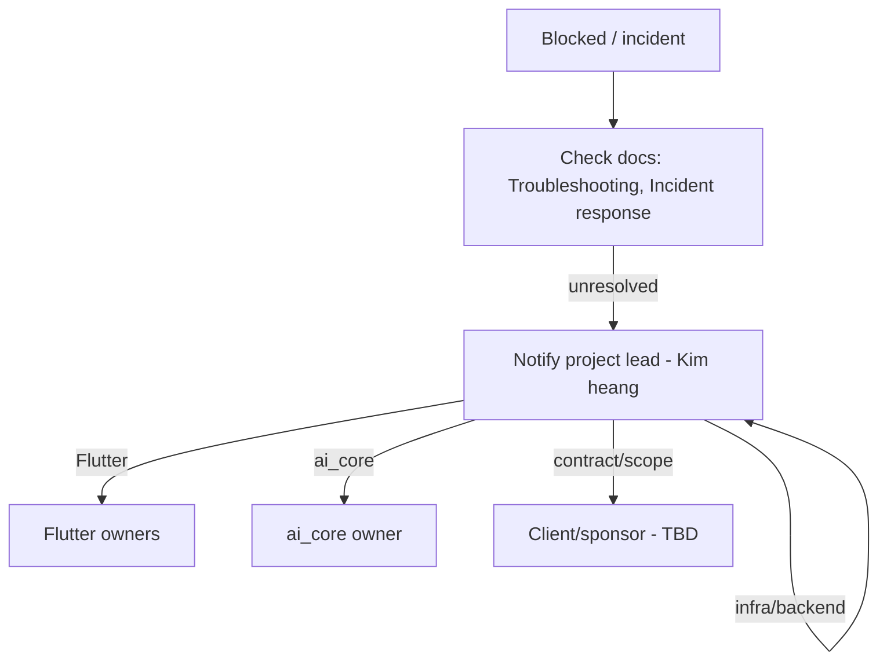

# Support & Escalation

> Status: Requires confirmation · Last reviewed: 2026-09-30
> Evidence: none found for a formal support process; `EVIDENCE-BASIS.md` §11, §12

Part of the Vithey documentation set · Master index: [`../00-project-overview/07-document-index.md`](../00-project-overview/07-document-index.md) · [Operation manual](01-operation-manual.md) · [Incident response](../15-monitoring/07-incident-response.md) · [Troubleshooting](04-troubleshooting.md)

## 1. Status: no formal support process

There is **no evidence** in the repository of a formal support process, ticket queue, SLA, on-call rota, or escalation path. This is expected for a competition/demo project with no deployed environments.

`TBD — Requires confirmation.` Formal support ownership, channels, response targets and escalation path are undefined.

## 2. What can be inferred (roles require confirmation)

Commit metadata suggests the following project contributors. Roles below are `[INFERRED]` from commit activity and must be confirmed:

| Area | Likely owner | Confidence |
|---|---|---|
| Project lead / backend / DevOps / integration | Kim heang | inferred |
| Gateway / auth / infrastructure | Ponloeng Bora | inferred |
| Flutter auth / settings / theme | namayheng | inferred |
| Flutter profile / settings / media / map | KhornMolika | inferred |
| ai_core | KosalChansothay | inferred |
| Flutter finance / ACLEDA payment | sovannarith | inferred |
| UI / naming | Heng Liza / Icesuza | inferred |

[INFERRED — `Inferred from implementation — requires business confirmation.` — `EVIDENCE-BASIS.md` §11]

Formal stakeholder names and contractual signatories are `TBD — Requires confirmation.`

## 3. Interim escalation guidance (advisory, not official)

Until a formal process exists, the practical path for a blocked issue is:

This is an **advisory** workflow derived from inferred roles. It is not an official escalation policy.

## 4. What to include in an escalation

- Environment (local development / local demo) and host.
- The exact command and its output.
- Which health checks fail (`check-service-health.ps1`, `verify-docker.ps1`).
- Relevant logs (`docker compose ... logs <service>`, or Loki query).
- Whether the issue reproduces after a clean restart.

[INFERRED — general good practice]

## 5. Gaps

| Gap | Status |
|---|---|
| Support channel (email/chat/tracker) | `TBD — Requires confirmation.` |
| Response/resolution targets (SLA) | `TBD — Requires confirmation.` |
| On-call rotation | None exists |
| Escalation authority | `TBD — Requires confirmation.` |
| External vendor support (LLM, Google Places) | Not documented; vendor terms are `TBD — Requires confirmation.` |
