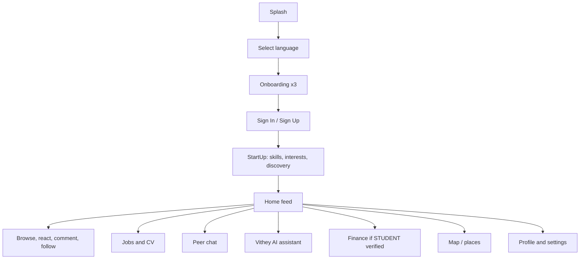

# Vithey User Manual

> Status: Verified (feature inventory) / Partially complete (stubs identified) · Last reviewed: 2026-09-30
> Evidence: `vithey_app/lib/routes/app_pages.dart`, `vithey_app/lib/core/constants/app_routes.dart`, `vithey_app/lib/modules/**`, `api_docs.md`
> Evidence anchor: `../_meta/EVIDENCE-BASIS.md`

## 1. About this manual

This is the end-user guide for **Vithey**, a student "superapp" built for the ACLEDA Bank App
Competition 2026 [VERIFIED]. The app is a Flutter client (`vithey_app`, package `aub_connect_app`,
version `1.0.0+1`) that talks only to the Vithey API gateway at `:8080` [VERIFIED].

> Scope note: the only **verified runtime environment** is the local demo stack
> (`backend/scripts/docker-up-demo.ps1`, Profile M). There is **no staging and no production**
> deployment [VERIFIED]. Web/Chrome is unsupported (Isar, secure storage, camera) [VERIFIED].

Each feature guide states explicitly whether a feature is **Implemented**, **Partial**, or
**Stub/Placeholder**. Do not assume a screen is fully functional because it is reachable.

## 2. What Vithey does

| Area | Guide | Status summary |
| --- | --- | --- |
| Sign in / register / onboarding | [02-login-registration.md](02-login-registration.md) | Implemented, except Google sign-in (**Stub**) |
| Profile & account | [03-profile-guide.md](03-profile-guide.md) | Implemented (some sections depend on backend) |
| Feed, reels, posts, search, notifications | [04-feed-guide.md](04-feed-guide.md) | Implemented |
| Jobs & CV (AI CV = real LLM) | [05-job-cv-guide.md](05-job-cv-guide.md) | Implemented; AI CV generate is real |
| Student finance | [06-finance-guide.md](06-finance-guide.md) | Partial — read-only; ACLEDA payment **Stub** |
| Peer chat | [07-chat-guide.md](07-chat-guide.md) | Implemented (realtime via STOMP) |
| AI assistant (Vithey AI) | [08-ai-assistant-guide.md](08-ai-assistant-guide.md) | Chat = **Stub**; CV generation = real |
| Map / places | [09-map-guide.md](09-map-guide.md) | Implemented; needs server Google Places key |
| FAQ / known gaps | [10-FAQ.md](10-FAQ.md) | — |

## 3. Navigation model

The authenticated app is a persistent shell with a floating pill bottom bar. Order is
**Profile · Home · Reel · Chatbot · Notifications** [VERIFIED: `lib/core/widgets/app_bottom_navigation.dart`,
`lib/core/navigation/main_tab_navigation.dart`, `lib/modules/home/shell/main_shell_screen.dart`].

| Tab | Icon | Route | Notes |
| --- | --- | --- | --- |
| Profile | avatar | `/profile` | Tab 0 |
| Home | house | `/home` | Tab 1 |
| Reel | clapperboard | `/reels` | Tab 2 |
| Chatbot (Vithey AI) | sparkles | `/chatbot` | Tab 3 — opens **full screen**, no bottom bar |
| Notifications | bell (+ unread badge) | `/notifications` | Tab 4 |

Additional destinations are opened from the **Home app bar** (Search, Map, Messages, Finance)
and from Profile/Settings [VERIFIED: `lib/modules/home/widgets/home_app_bar.dart`].

- **Messages (peer chat)** is reached from the Home app-bar chat icon → `/chat`.
- **Finance** is reached from the Home app-bar wallet icon. The entry first checks student
  verification and routes you to verification, verification status, or the finance dashboard
  accordingly [VERIFIED: `lib/data/repositories/student_verification_repository.dart` `FinanceNavigation`].
- **Map** and **Search** are Home app-bar icons. Other screens are pushed on top of the shell.

## 4. First-run journey

Runtime gating is manual (no GetX middleware): `SplashController` plus `AuthNavigation` decide
whether to show onboarding, auth, the StartUp funnel, or the Home shell
[VERIFIED: `lib/modules/auth/splash/splash_controller.dart`, `lib/core/utils/auth_navigation.dart`].

## 5. Roles and what they unlock

| Role | How obtained | What changes in the app |
| --- | --- | --- |
| `USER` | Register | Default app experience |
| `COMPANY` | Register as company | Post `JOB` listings; review applicants |
| `STUDENT` | `POST /students/verify` | Finance screens become available |
| `ADMIN` | Backend only | Not exposed in the Flutter app |

[VERIFIED: `api_docs.md` §18]

## 6. What is NOT active (read before demo)

Be explicit with end users/demoers about the following verified gaps:

- **Google sign-in is a placeholder** — the UI exists, but the real provider handoff is stubbed
  and the feature is gated by `ENABLE_GOOGLE_AUTH` (default `false`) [VERIFIED: `lib/modules/auth/auth_controller.dart`, `.env.example`].
- **Push notifications are not active** — FCM is disabled (`FCM_ENABLED=false`) and no Firebase
  packages or `google-services.json` are wired [VERIFIED: `lib/core/config/feature_flags.dart`, `.env.example`].
- **Vithey AI chat returns canned stub replies** (no RAG / no GDCE). Only **CV generation** uses a
  real LLM [VERIFIED: `ai_core/vithey_ai/api/flutter_routes.py`, `_meta/EVIDENCE-BASIS.md` §6].
- **ACLEDA Mobile payment is not integrated** — the "Pay with ACLEDA" action is a deep-link launcher
  plus a preview flow; no payment is processed [VERIFIED: `lib/modules/finance/payment/acleda_mobile_launcher.dart`, `payment_controller.dart`].
- **Several settings are "coming soon"** — Two-Factor Authentication, Biometric Login, Data &
  storage, Accessibility, chatbot attachments, and chatbot history search
  [VERIFIED: `lib/modules/settings/**`].
- **Chat call/video is simulated**, not real telephony [VERIFIED: `lib/data/repositories/chat_repository.dart`].
- **Release build signs with debug keys** (explicit TODO) [VERIFIED: `vithey_app/android/app/build.gradle`].

## 7. Environment defaults

The app reads `.env` as a declared asset. Defaults: `API_BASE_URL=http://localhost:8080/api/v1`,
`WS_BASE_URL=ws://10.0.2.2:8080/ws` [VERIFIED: `lib/core/config/app_config.dart`, `api_docs.md` §1].
Android emulators reach the host at `10.0.2.2`; a physical device needs the PC LAN IP.

## 8. Related documents

- Feature-by-feature guides: files `02-` … `10-` in this folder.
- API contract: [`../../api_docs.md`](../../api_docs.md), [`../06-api/`](../06-api/)
- Master index: [`../00-project-overview/07-document-index.md`](../00-project-overview/07-document-index.md)
