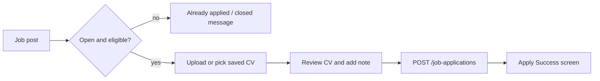

# Jobs & CV Guide

> Status: Verified (core) / AI CV = real LLM · Last reviewed: 2026-09-30
> Evidence: `vithey_app/lib/modules/jobs/**`, `vithey_app/lib/modules/profile/**`, `api_docs.md` §7, §10
> Evidence anchor: `../_meta/EVIDENCE-BASIS.md`

## 1. How jobs appear

Job listings are **content posts** of type `JOB`, not a separate service. They appear in the Home
feed and are discoverable via Search [VERIFIED: `api_docs.md` §7, §13]. There is no
`GET /api/v1/jobs/**` controller — the gateway route exists but is unused
[VERIFIED: `api_docs.md` §15].

- `COMPANY` accounts create job posts (`type=JOB` with `job_meta`).
- Job lifecycle is reflected in the feed (`open` vs closed, applies state).

## 2. Applying to a job

The apply flow is `/apply-cv` in two steps **(Upload → Review)**
[VERIFIED: `lib/modules/jobs/apply_cv_controller.dart`].

Steps [VERIFIED: `apply_cv_controller.dart`, `api_docs.md` §7]:

1. Choose a **Position** (auto-detected from the job title).
2. Choose a CV: a **saved CV** or upload a local file (JPG, PNG, or PDF, max 5 MB).
   - Upload path: `POST /files/upload` (`type=CV`) → optional `PUT /users/me/cv` → `POST /job-applications`.
3. Add an optional application note, review, then **Submit Application**.
   - `POST /job-applications` with `{ "job_post_id", "cv_file_id", "application_note?" }`.
   - Optional `Idempotency-Key` header is supported server-side.

Eligibility is re-checked at submit time; if the job closed or you already applied, a clear message
is shown instead of a duplicate [VERIFIED: `apply_cv_controller.dart`].

## 3. Application status

`/apply-cv/status` shows your application status [VERIFIED: `lib/modules/jobs/application_status_screen.dart`].

**Status enum:** `PENDING` → `REVIEWED` → `ACCEPTED` / `REJECTED` [VERIFIED: `api_docs.md` §7].

## 4. AI CV creation (real LLM)

**Jobs → Auto-Create CV** (`/apply-cv/ai-create`) generates a CV draft from your profile and recent
posts using `ai_core` → LLM. This is a **real** backend feature, not a stub
[VERIFIED: `_meta/EVIDENCE-BASIS.md` §6, `api_docs.md` §10].

Flow [VERIFIED: `lib/modules/jobs/ai_cv/ai_cv_controller.dart`, `api_docs.md` §10]:

1. Open the **CV template gallery** (`/apply-cv/templates`) and pick a template.
2. `POST /ai/cv/generate` (body may be omitted) → returns an `AiCvDraft`:
   `full_name`, `summary`, `skills`, `education`, `experience`, `projects`, `contact`,
   `quality_score`, `quality_grade`.
3. Edit any section inline; optionally regenerate the summary.
4. **Save** the draft (becomes a CV file, optionally set as default) or **use for this job**
   (returns to the apply review step).

Notes:
- If your profile is too empty, the server returns an **incomplete draft** message instead of
  calling the LLM [VERIFIED: `api_docs.md` §10].
- You can also **download/share a PDF** of the draft (`CvPdfBuilder`).
- Known limitation: a field-name mismatch in the draft mapper can drop fields in the Flutter draft
  (`items` vs `skills`, `summary` vs `bullets`) — the response is valid but may be less complete
  [VERIFIED: `_meta/EVIDENCE-BASIS.md` §6, `../06-api/12-ai-api.md` §5].

## 5. Saved CV

`/users/me/cv` holds your default CV; `GET /users/me/cv` returns it and `PUT /users/me/cv` sets it
[VERIFIED: `api_docs.md` §7]. The profile's **own CV preview** (`/profile/cv`) renders it, and
`/files/{id}/download` is owner-restricted [VERIFIED: `api_docs.md` §5].

## 6. Reviewing applicants (COMPANY)

`/profile/jobs/applicants` lists applicants for a job you posted; `/profile/applicants/detail` shows
one applicant and their CV [VERIFIED: `lib/modules/profile/job_applicants_screen.dart`,
`applicant_detail_screen.dart`].

| Action | Endpoint | Notes |
| --- | --- | --- |
| List applicants | `GET /job-applications?job_post_id=` | Poster only |
| CV preview | `GET /job-applications/{id}/cv-preview` | Returns `cv_file_id`, `download_url` |
| Update status | `PATCH /job-applications/{id}/status` | Poster only; `{ "status", "reviewer_note?" }` |

[VERIFIED: `api_docs.md` §7]

> An applicant "AI match" panel exists in the UI, but the job-match endpoint is **not shipped**
> (`POST /ai/jobs/{id}/match` is a Flutter stub returning neutral values)
> [VERIFIED: `api_docs.md` §10, §15].

## 7. Related

- [08-ai-assistant-guide.md](08-ai-assistant-guide.md) · [03-profile-guide.md](03-profile-guide.md) · [04-feed-guide.md](04-feed-guide.md)
- [../06-api/07-career-api.md](../06-api/07-career-api.md) · [../06-api/12-ai-api.md](../06-api/12-ai-api.md)
- Master index: [`../00-project-overview/07-document-index.md`](../00-project-overview/07-document-index.md)
