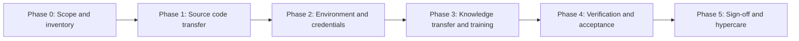

# Handover Plan

> Status: **Planned** — handover has NOT occurred · Last reviewed: 2026-09-30
> Evidence: `AGENTS.md`, `plan.md`, `.github/workflows/ci-promote-dev.yml`, `backend/`, `vithey_app/`, `ai_core/`
> Evidence anchor: `../_meta/EVIDENCE-BASIS.md`

> **No handover has taken place.** This is a **proposed plan** only. No transfer, acceptance,
> training, or sign-off has been executed. All names, dates, and signatures are blank/TBD
> [VERIFIED: `_meta/EVIDENCE-BASIS.md` §12].

## 1. Purpose

Define how the Vithey monorepo (`D:\project\Acleda Mobile App`) would be transferred from the
current development team to a receiving team/owner. It covers what to hand over, in what order, and
the artefacts and evidence each step requires.

## 2. Scope of the handover

| Item | Path / artefact | In scope |
| --- | --- | --- |
| Flutter mobile app | `vithey_app/` | Yes |
| Backend services | `backend/` | Yes |
| AI engine | `ai_core/` | Yes |
| Monitoring stack | `monitoring/` | Yes (profile-gated) |
| CI workflows | `.github/workflows/` | Yes |
| Documentation package | `docs/` | Yes |
| Reference specs/prompts | `docs/Prompt *`, `docs/_shared` | Reference only |
| Demo runbook | `plan.md`, `backend/DEMO.md` | Yes |
| API contract | `api_docs.md` | Yes |
| Secrets/credentials | (none committed) | Via [05-credential-handover-checklist.md](05-credential-handover-checklist.md) |

## 3. Status of the delivery

Documented environment status [VERIFIED: `_meta/EVIDENCE-BASIS.md` §9, §12]:

| Environment | Status |
| --- | --- |
| Local development | Local development (verified) |
| Local demo (Profile M) | Local demo (verified) |
| Staging | Staging (does not exist) |
| Production | Production (does not exist) |

Governance: UAT **not yet executed**; production deployment **not performed**; formal security
assessment **not performed**; formal acceptance/sign-off **not present**.

## 4. Proposed phases

| Phase | Goal | Outputs | Status |
| --- | --- | --- | --- |
| 0 — Scope & inventory | Agree what transfers | This plan + [02-handover-checklist.md](02-handover-checklist.md) | Planned |
| 1 — Source code | Recipient can clone, build, run | [03-source-code-handover.md](03-source-code-handover.md) | Planned |
| 2 — Environment & credentials | Recipient can stand up the demo | [04-environment-handover.md](04-environment-handover.md), [05-credential-handover-checklist.md](05-credential-handover-checklist.md) | Planned |
| 3 — Knowledge transfer & training | Recipient understands the system | [06-training-plan.md](06-training-plan.md), [07-knowledge-transfer.md](07-knowledge-transfer.md) | Planned |
| 4 — Verification | Recipient reproduces key flows | Checklist evidence | Planned |
| 5 — Sign-off & hypercare | Formal acceptance | [08-handover-signoff.md](08-handover-signoff.md) | Planned |

## 5. Roles (proposed, unconfirmed)

| Role | Responsibility | Named owner |
| --- | --- | --- |
| Handover lead (giving) | Coordinates transfer | TBD — Requires confirmation. |
| Receiving lead | Accepts the system | TBD — Requires confirmation. |
| Backend/DevOps owner | Services, CI, Docker | TBD — Requires confirmation. |
| Flutter owner | Mobile app build/signing | TBD — Requires confirmation. |
| AI owner | `ai_core`, LLM key | TBD — Requires confirmation. |
| Security owner | Credential custody | TBD — Requires confirmation. |

Team names in `_meta/EVIDENCE-BASIS.md` §11 are **inferred from git authors** and require
confirmation; they are **not** formal handover signatories.

## 6. Risks to the handover

| Risk | Impact | Proposed mitigation | Status |
| --- | --- | --- | --- |
| No staging/production to transfer | Recipient inherits a demo only | Document "does not exist"; scope decision needed | Open |
| Secrets held locally (not in repo) | Recipient cannot run AI/map | Credential checklist with `<REDACTED>` placeholders | Open |
| Config-server image bakes config | Config edits need image rebuild | Document rebuild caveat (see [03](03-source-code-handover.md)) | Open |
| Known data defects (duplicate career `V3`, etc.) | Confusing migrations | Documented; do not silently fix | Open |
| No UAT/security assessment | Acceptance basis missing | Record as explicit TBD | Open |

## 7. Exit criteria (proposed)

- [ ] Recipient can build and run all three toolchains from a clean checkout.
- [ ] Recipient can start the demo stack and reach all health endpoints.
- [ ] All credentials are transferred through an approved secure channel.
- [ ] Knowledge-transfer sessions completed and recorded.
- [ ] [08-handover-signoff.md](08-handover-signoff.md) completed by all parties.

None of the above have been performed.

## 8. Related

- [02-handover-checklist.md](02-handover-checklist.md) · [03-source-code-handover.md](03-source-code-handover.md) · [08-handover-signoff.md](08-handover-signoff.md)
- [../12-uat/05-UAT-signoff.md](../12-uat/05-UAT-signoff.md) · [../00-project-overview/07-document-index.md](../00-project-overview/07-document-index.md)
