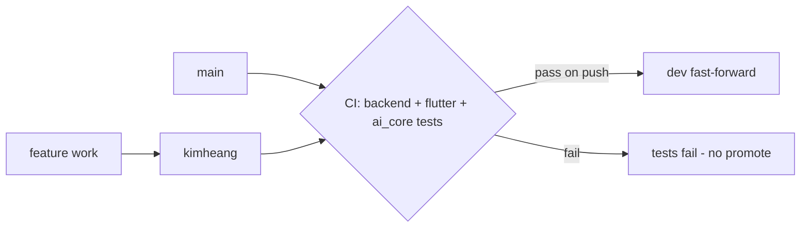

# Source Code Handover

> Status: **Reference (verified repository facts)** — handover has NOT occurred · Last reviewed: 2026-09-30
> Evidence: `git remote`, `.github/workflows/ci-promote-dev.yml`, `AGENTS.md`, `vithey_app/pubspec.yaml`, `backend/pom.xml`, `ai_core/pyproject.toml`
> Evidence anchor: `../_meta/EVIDENCE-BASIS.md`

## 1. Repositories

| Remote | URL |
| --- | --- |
| `origin` | `https://github.com/Kimheang-code-IT/Mobile-App-ACLEDA.git` |
| `upstream` | `https://github.com/vithey-mobile/Mobile-App-ACLEDA.git` |

[VERIFIED: git remote; `_meta/EVIDENCE-BASIS.md` §1]

## 2. Branch model

- Working/integration branch at documentation time: **`kimheang`**.
- **`main`** is the primary integration branch.
- **`dev`** receives automatic fast-forward promotion from passing `kimheang`/`main` commits
  by `.github/workflows/ci-promote-dev.yml` (`promote-to-dev` job).
- CI triggers on pushes to `kimheang` and `main`, and on PRs to `kimheang`, `main`, `dev`.
- Reference tag: `presync-20260930` at commit `3537584` ("updaate version 0.0.3").

[VERIFIED: `.github/workflows/ci-promote-dev.yml`; `_meta/EVIDENCE-BASIS.md` §1]



> CI can push to `dev` but there is **no staging and no production** branch/environment
> [VERIFIED: `_meta/EVIDENCE-BASIS.md` §9].

## 3. Repository layout

| Path | What | Toolchain |
| --- | --- | --- |
| `vithey_app/` | Flutter app (GetX, Dio, Isar) — pubspec package `aub_connect_app` | Flutter / Dart |
| `backend/` | Maven multi-module Spring Cloud stack (gateway + 9 domain services + eureka + config) | Java 21 / Maven / Spring Boot 3.3.5 |
| `ai_core/` | Python CV/chat engine — package `vithey_ai`, CLI `python main.py extract\|generate\|serve` | Python 3.10+ |
| `monitoring/` | Prometheus / Grafana / Loki / Promtail / node-exporter / cAdvisor | Docker Compose |
| `docs/` | Documentation package + preserved reference specs | — |
| `plan.md`, `api_docs.md` | Locked demo plan; Flutter↔gateway contract | — |

[VERIFIED: `AGENTS.md`, `_meta/EVIDENCE-BASIS.md` §2]

## 4. Build & run commands

### Flutter (`vithey_app/`)
`.env` is a declared pubspec asset and gitignored — **copy it before any build/analyze/test**:
```powershell
copy .env.example .env
flutter pub get
flutter analyze --no-fatal-infos
flutter test
flutter run
```
[VERIFIED: `AGENTS.md`; `.env.example`]

### Backend (`backend/`)
```powershell
mvn test
mvn -pl services/auth-service -am test
mvn test -Dtest=CareerServiceSmokeIT
```
`*SmokeIT` are Testcontainers tests requiring Docker. Java 21 required.
[VERIFIED: `AGENTS.md`, `backend/TESTING.md`]

### ai_core (`ai_core/`)
```powershell
pip install -e ".[server,dev]"
pytest
python main.py serve --port 8100
```
[VERIFIED: `AGENTS.md`, `ai_core/README.md`]

### Demo stack (from `backend/`)
```powershell
copy .env.example .env
.\scripts\docker-up-demo.ps1
.\scripts\docker-up-demo.ps1 -Profiles map
.\scripts\smoke-api.ps1
.\scripts\docker-down-demo.ps1   # -v to wipe volumes
```
[VERIFIED: `AGENTS.md`, `plan.md`]

## 5. Generated code

- Flutter **Isar** models are generated. After editing `lib/data/local/isar/*.dart`, run:
  `dart run build_runner build --delete-conflicting-outputs`.
- `*.g.dart` files are **committed** and excluded from the analyzer — do not hand-edit them.
[VERIFIED: `AGENTS.md`, `_meta/EVIDENCE-BASIS.md` §7]

## 6. Configuration caveat (config-server)

Service runtime config lives in `backend/infrastructure/config-repo/*.yml` and is **baked into the
config-server image** (Spring Cloud Config native profile). **Changing config requires rebuilding the
config-server image**; a local compose also bind-mounts the repo for convenience
[VERIFIED: `AGENTS.md`, `_meta/EVIDENCE-BASIS.md` §4].

## 7. Generated/derived artefacts to be aware of

| Artefact | Location | Note |
| --- | --- | --- |
| Isar generated models | `vithey_app/lib/**/*.g.dart` | Committed; regenerate with build_runner |
| Flyway migrations | `backend/services/*/src/main/resources/db/migration` | Never edit applied migrations |
| OpenAPI (ai_core) | served at runtime (`/docs`, `/openapi.json`) | No committed spec |

## 8. Known source-level defects to hand over (do not silently fix)

1. career-service **duplicate Flyway version `V3`**.
2. career `UserCv` entity `@Id` maps `user_id` while DB PK is `id`.
3. user-profile trigram index is a **no-op** (V3 re-create skipped by `IF NOT EXISTS`).
4. Enum vs DB CHECK **supersets** across career/content/chat/finance/notification.
5. `*SmokeIT` tests are **not run by plain `mvn test`** (no failsafe config).

[VERIFIED: `_meta/EVIDENCE-BASIS.md` §8]

## 9. TBD for this handover

- Repository ownership/transfer mechanism (org, access grants): TBD — Requires confirmation.
- Whether `upstream` is the intended long-term home: TBD — Requires confirmation.
- License / IP assignment: TBD — Requires confirmation.

## 10. Related

- [01-handover-plan.md](01-handover-plan.md) · [04-environment-handover.md](04-environment-handover.md) · [07-knowledge-transfer.md](07-knowledge-transfer.md)
- [../00-project-overview/07-document-index.md](../00-project-overview/07-document-index.md)
