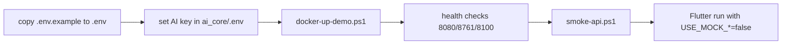

# Environment Handover

> Status: **Reference (verified environment facts)** — handover has NOT occurred · Last reviewed: 2026-09-30
> Evidence: `AGENTS.md`, `plan.md`, `backend/DOCKER.md`, `backend/.env.example`, `backend/infrastructure/config-repo/*.yml`, `monitoring/README.md`
> Evidence anchor: `../_meta/EVIDENCE-BASIS.md`

> **No environment handover has occurred.** Environments are documented here as they exist in the
> repository; staging and production do not exist [VERIFIED: `_meta/EVIDENCE-BASIS.md` §9, §12].

## 1. Environment inventory

| Environment | Status | How it runs |
| --- | --- | --- |
| Local development | Local development (verified) | `backend/scripts/start-dev-host.ps1` (infra in Docker, JVMs on host) |
| Local demo (Profile M) | Local demo (verified) | `backend/scripts/docker-up-demo.ps1` |
| Staging | Staging (does not exist) | — |
| Production | Production (does not exist) | `application-prod.yml` exists but nothing activates it |

[VERIFIED: `AGENTS.md`, `_meta/EVIDENCE-BASIS.md` §9]

## 2. Host ports

| Component | Port |
| --- | --- |
| api-gateway | 8080 |
| auth-service | 8081 |
| user-profile-service | 8082 |
| file-service | 8083 |
| content-service | 8084 |
| career-service | 8085 |
| finance-service | 8086 |
| chat-service | 8087 |
| notification-service | 8088 |
| map-service | 8090 |
| ai_core | 8100 |
| eureka-server | 8761 |
| config-server | 8888 |
| PostgreSQL | 15432 (full stack) / 15433 (infra-only) |
| Redis | 16379 |
| RabbitMQ | 5672 (+15672 mgmt) |
| MinIO | 19000 / 19001 |
| Prometheus / Grafana / Loki | (monitoring profile) |

[VERIFIED: `AGENTS.md`, `_meta/EVIDENCE-BASIS.md` §3]

## 3. Infrastructure and dependencies

| Dependency | Role | Notes |
| --- | --- | --- |
| PostgreSQL | One database per service | `init-databases.sql` creates all DBs |
| Redis | Gateway rate limiting; chat cache; map cache | Imperative `StringRedisTemplate` |
| RabbitMQ | Async events on exchange `vithey.events` | Single topic exchange |
| MinIO | File storage (avatars, CVs, posters, videos) | Host ports 19000/19001 |
| Eureka | Service discovery | Services register; server does not self-register |
| Config | Spring Cloud Config native (files in `config-repo/`) | Config baked into config-server image |

[VERIFIED: `_meta/EVIDENCE-BASIS.md` §3, §4]

## 4. Environment files (names only — see credential checklist)

Copy each `.env.example` to `.env`; never commit `.env`. Files exist for:

| File | Purpose |
| --- | --- |
| `backend/.env.example` | Compose resource caps, optional profiles |
| `backend/infrastructure/.env.example` | Postgres/RabbitMQ/MinIO/JWT seed values |
| `backend/services/*/.env.example` | Per-service DB/queue/MinIO/JWT settings |
| `vithey_app/.env.example` | API/WS base URLs, mock flags, feature flags |
| `ai_core/.env.example` | `DEEPSEEK_*` LLM config + API guards |
| `monitoring/.env.example` | Grafana user/password |

[VERIFIED: glob `.env.example`; `AGENTS.md`]

> Secrets are **never** in git: only `.env.example` is tracked [VERIFIED: `_meta/EVIDENCE-BASIS.md` §5].
> Actual secret NAMES to transfer are listed in [05-credential-handover-checklist.md](05-credential-handover-checklist.md).

## 5. Demo runbook

Pre-checks (from `plan.md` §7) include: GDCE/general-service **not** running; all domain services
healthy; login seed user works; `ai_core/.env` has an LLM key; `POST /ai/cv/generate` returns a
draft; Vithey AI chat returns a **stub** reply [VERIFIED: `plan.md` §7.2].

## 6. Resource configuration

All compose caps (`mem_limit`, JVM flags, pools, datastore sizing) come from `backend/.env`; nothing
is hardcoded in compose. `backend/.env` is **absent by default** so built-in defaults apply
[VERIFIED: `AGENTS.md`, `_meta/EVIDENCE-BASIS.md` §9].

- `SERVICE_JAVA_OPTS`, `SERVICE_MEM_LIMIT`, `GATEWAY_JAVA_OPTS`, `PLATFORM_JAVA_OPTS`
- `PG_MEM_LIMIT`, `PG_MAX_CONNECTIONS`, `REDIS_MAXMEMORY`, `RABBITMQ_MEM_LIMIT`, `MINIO_MEM_LIMIT`
- `AI_CORE_MEM_LIMIT`, `AI_CORE_WORKERS`

[VERIFIED: `backend/.env.example`]

## 7. Monitoring

Monitoring is **profile-gated** (`--profile monitoring`). Prometheus scrapes `/actuator/prometheus`
for 8 services (not eureka/config/map/ai_core); Grafana dashboards are provisioned; Loki retains
168h. Alerts are defined but there is **no Alertmanager** [VERIFIED: `_meta/EVIDENCE-BASIS.md` §9].

## 8. Health endpoints

| Service | URL |
| --- | --- |
| Gateway | `http://localhost:8080/actuator/health` |
| Any Java service | `http://localhost:<port>/actuator/health` |
| ai_core | `http://localhost:8100/health` |
| Eureka dashboard | `http://localhost:8761` |

[VERIFIED: `_meta/EVIDENCE-BASIS.md` §9, `api_docs.md` §16]

## 9. TBD for this handover

- Target host/OS for the recipient demonstration: TBD — Requires confirmation.
- Whether a shared demo server will be provisioned: TBD — Requires confirmation.
- Bank-approved production hosting: TBD — Requires confirmation.

## 10. Related

- [03-source-code-handover.md](03-source-code-handover.md) · [05-credential-handover-checklist.md](05-credential-handover-checklist.md) · [06-training-plan.md](06-training-plan.md)
- [../00-project-overview/07-document-index.md](../00-project-overview/07-document-index.md)
