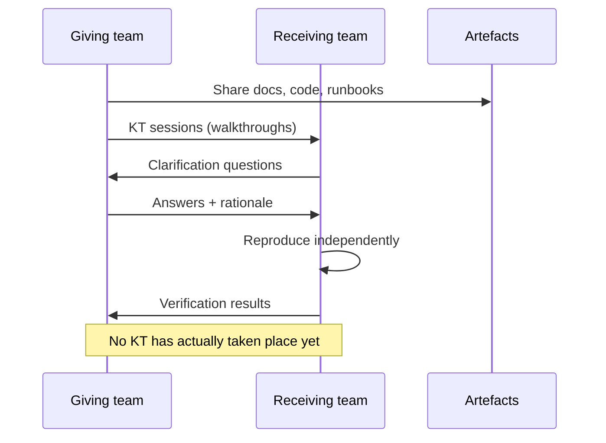

# Knowledge Transfer (KT)

> Status: **Planned** — KT has NOT been conducted · Last reviewed: 2026-09-30
> Evidence: `AGENTS.md`, `plan.md`, `api_docs.md`, `docs/` package; no KT records found
> Evidence anchor: `../_meta/EVIDENCE-BASIS.md`

> **No knowledge transfer has occurred.** This document proposes the transfer process and the topic
> map. All owner names, dates, and completion marks are TBD/blank.

## 1. Why KT is separate from training

[Training](06-training-plan.md) teaches the mechanics. **Knowledge transfer** is the contextual
handoff of decisions, rationale, risks, and tacit knowledge that is not obvious from the code — so
the receiving team can own and evolve Vithey without the original authors.

## 2. Transfer model

## 3. Topic map (what must be transferred)

| # | Topic | Key facts to transfer | Source | Status |
| --- | --- | --- | --- | --- |
| K1 | Architecture rules | Flutter→gateway only; gateway→ai_core direct route; Eureka/Config native | `AGENTS.md`, `_meta/EVIDENCE-BASIS.md` §4 | Not transferred |
| K2 | Why `ai-service` was retired | Java AI service gone; Python `ai_core` owns `/ai/**` | `backend/DOCKER.md`, `api_docs.md` §10 | Not transferred |
| K3 | Chat vs CV split | Chat is a **stub**; CV uses the **real LLM** | `_meta/EVIDENCE-BASIS.md` §6 | Not transferred |
| K4 | Security model | JWT HS256, 15m/7d, gateway injects `X-User-*`, Redis rate limiter | `_meta/EVIDENCE-BASIS.md` §5 | Not transferred |
| K5 | Data model | One DB per service; Flyway; defect list | `_meta/EVIDENCE-BASIS.md` §8, `docs/05-database/` | Not transferred |
| K6 | Messaging | RabbitMQ exchange `vithey.events`, producer/consumer keys | `_meta/EVIDENCE-BASIS.md` §4 | Not transferred |
| K7 | CI/CD reality | Tests + images + auto-promote to `dev`; no staging/prod | `.github/workflows/ci-promote-dev.yml` | Not transferred |
| K8 | Configuration caveat | Config baked into config-server image; rebuild to change | `AGENTS.md` | Not transferred |
| K9 | Stubs & limitations | Google auth, FCM, ACLEDA payment, 2FA/biometric, calls | `_meta/EVIDENCE-BASIS.md` §7; this docs set | Not transferred |
| K10 | Known defects | career `V3` duplicate, `UserCv` id, trigram no-op, enum supersets | `_meta/EVIDENCE-BASIS.md` §8 | Not transferred |
| K11 | Release signing | Android release currently debug-signed (TODO) | `vithey_app/android/app/build.gradle` | Not transferred |

## 4. Proposed KT sessions

| Session | Topics | Owner (proposed) | Date | Status |
| --- | --- | --- | --- | --- |
| KT-A | K1, K2, K7, K8 | TBD — Requires confirmation. | TBD | Not started |
| KT-B | K3, K4, K5, K6 | TBD — Requires confirmation. | TBD | Not started |
| KT-C | K9, K10, K11 | TBD — Requires confirmation. | TBD | Not started |

## 5. Artefacts to accompany KT

- This documentation package (`docs/`) including user manuals and handover docs.
- `plan.md` (locked demo plan), `api_docs.md` (gateway contract), `AGENTS.md` (contributor entry).
- `backend/DEMO.md`, `backend/TESTING.md`, `backend/DOCKER.md`, `monitoring/README.md`.
- Open questions/decisions log (`plan.md` §13).

## 6. Completion criteria

- [ ] All K1–K11 topics walked through with the receiving team.
- [ ] Recipient can answer "why is chat a stub?" and "how is config changed?" unaided.
- [ ] Recipient can list the deployed-environment status (local only).
- [ ] Open questions captured with owners.
- [ ] KT notes/recordings stored: TBD — Requires confirmation.

## 7. Current status

**Knowledge transfer has not yet been conducted. No KT evidence was found.**

## 8. Related

- [06-training-plan.md](06-training-plan.md) · [03-source-code-handover.md](03-source-code-handover.md) · [08-handover-signoff.md](08-handover-signoff.md)
- [../00-project-overview/07-document-index.md](../00-project-overview/07-document-index.md)
