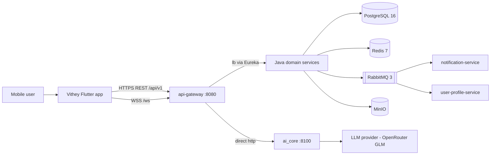

# System Architecture

> Status: Verified · Last reviewed: 2026-09-30
> Evidence: `backend/infrastructure/config-repo/*.yml`, `backend/docker-compose.yml`, `backend/services/*/src/main/java`, `ai_core/vithey_ai/`, `vithey_app/lib/`, `monitoring/`
> Part of the Vithey documentation set · Master index: [`../00-project-overview/07-document-index.md`](../00-project-overview/07-document-index.md) · Detailed sibling: [`../03-system-design/01-system-architecture.md`](../03-system-design/01-system-architecture.md)

> This report version is written for management. The authoritative, code-level version lives in
> the sibling document linked above; that document wins on any discrepancy.

## 1. Architecture at a glance

Vithey uses a **gateway-first microservice architecture**. The mobile app talks only to the API
gateway; the gateway routes to independent domain services, to the Python AI engine, and to a
realtime WebSocket endpoint. Shared infrastructure provides data, messaging, files, discovery,
and configuration.

[VERIFIED] `../03-system-design/01-system-architecture.md`

## 2. Components and ports

| Component | Role | Port | Data store |
| --- | --- | --- | --- |
| `api-gateway` | Single entry, routing, JWT validation, rate limiting | 8080 | Redis |
| `auth-service` | Identity, JWT, student verification | 8081 | `auth_db` |
| `user-profile-service` | Profile, settings, user search | 8082 | `user_db` |
| `file-service` | Avatar/CV/poster/video/chat uploads | 8083 | `file_db` + MinIO |
| `content-service` | Feed, posts, comments, reactions, follow | 8084 | `content_db` |
| `career-service` | Job applications, applicant review, user CV | 8085 | `career_db` |
| `finance-service` | Fees and payments (STUDENT only, read-only) | 8086 | `finance_db` |
| `chat-service` | Peer chat REST + STOMP realtime | 8087 | `chat_db` + Redis |
| `notification-service` | In-app inbox and events | 8088 | `notification_db` |
| `map-service` | Nearby places (opt-in) | 8090 | `map_db` + Redis |
| `eureka-server` | Service discovery | 8761 | — |
| `config-server` | Centralized configuration (native) | 8888 | `config-repo` |
| `ai_core` | AI engine (CV + chat) | 8100 | LLM provider |

[VERIFIED] `backend/infrastructure/config-repo/*.yml`, `backend/docker-compose.yml`, `ai_core/Dockerfile`

> Note: the Java `ai-service` (historically port 8089) **does not exist and is retired**. Do not
> reintroduce it. [VERIFIED] `backend/DOCKER.md`, `api_docs.md` §10

## 3. Gateway routing (summary)

The gateway defines 13 routes; all HTTP routes carry a Redis rate limiter. Route **order**
matters: specific `/api/v1/users/...` routes (CV, follow, posts) are evaluated before the
catch-all `/api/v1/users/**`. [VERIFIED] `config-repo/api-gateway.yml`, `api_docs.md` §15

| Client path prefix | Routed to |
| --- | --- |
| `/api/v1/auth/**`, `/api/v1/students/verify` | auth-service |
| `/api/v1/users/me/cv/**` | career-service |
| `/api/v1/users/*/follow`, `/followers`, `/following`, `/posts` | content-service |
| `/api/v1/users/**` (else) | user-profile-service |
| `/api/v1/files/**` | file-service |
| `/api/v1/posts/**`, comments, reactions | content-service |
| `/api/v1/job-applications/**` | career-service |
| `/api/v1/fees/**`, `/api/v1/payments/**` | finance-service |
| `/api/v1/conversations/**`, `/messages/**`, `/message-requests/**` | chat-service |
| `/ws/**` | chat-service (STOMP WebSocket) |
| `/api/v1/notifications/**` | notification-service |
| `/api/v1/ai/**` | ai_core (direct HTTP, not via Eureka) |
| `/api/v1/places/**` | map-service (opt-in profile) |

## 4. Security boundary

- The gateway validates the Bearer JWT and injects `X-User-Id`, `X-User-Roles`, `X-User-Email`
  for downstream services. Public endpoints are limited to register, login, refresh,
  forgot/reset password, verify email, actuator, and swagger. [VERIFIED]
- Each domain service also validates the JWT (defense in depth). [VERIFIED]
- JWTs use HMAC with a 15-minute access token and 7-day refresh token; roles are `USER`,
  `STUDENT`, `COMPANY`, and `ADMIN`. [VERIFIED]

> The service layer trusts the identity headers injected by the gateway. This is only safe while
> service ports remain network-isolated. This is the highest-priority item to validate before any
> exposure. [VERIFIED] `../10-security/11-security-review-report.md`

## 5. Integration and messaging

- **Synchronous:** OpenFeign over Eureka, with circuit breakers enabled globally. [VERIFIED]
- **Asynchronous:** RabbitMQ single topic exchange `vithey.events`. Producers include auth,
  content, career, chat, finance, and user-profile; notification, user-profile, and finance
  consume events. [VERIFIED] `../_meta/EVIDENCE-BASIS.md` §4
- **Caching:** Redis is used imperatively for gateway rate limiting, chat recent-message cache,
  and map places cache (with degrade-on-failure). [VERIFIED]

## 6. Environments

| Environment | Status |
| --- | --- |
| Local development | Local development (verified) |
| Local demo ("Profile M") | Local demo (verified) |
| Staging | Staging (does not exist) |
| Production | Production (does not exist) |

[VERIFIED] `../_meta/EVIDENCE-BASIS.md` §9 — see [`13-deployment-status.md`](13-deployment-status.md)

## 7. Open items

- Whether identity-header trust is acceptable given the bank's network model. [TBD] `TBD — Requires confirmation.`
- Formal architecture sign-off. [TBD] `TBD — Requires confirmation.`

## 8. Related documents

- [`06-solution-overview.md`](06-solution-overview.md) · [`08-implemented-features.md`](08-implemented-features.md) · [`13-deployment-status.md`](13-deployment-status.md)
- [`../03-system-design/01-system-architecture.md`](../03-system-design/01-system-architecture.md) · [`../08-backend/01-backend-architecture.md`](../08-backend/01-backend-architecture.md)
