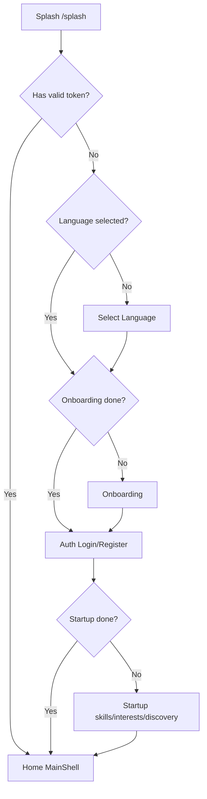

# Navigation & Screen Flow

## App entry flow



## Main navigation (after login)

```text
Home (MainShell — feed tab)
├── Reels (full-screen / tab)
├── Create Post
├── Post Detail → Apply CV (job posts)
├── Profile (self or other user)
│   ├── Preview CV (/profile/cv)
│   ├── Edit Profile
│   ├── Applicant list → Applicant Detail → View CV
│   ├── Settings (+ sub-screens)
│   └── Student Verification → Finance
├── Chat list → Chat Detail → Chat Profile
│   └── Add Chat → Search (pick user mode)
├── Notifications
├── Search (app bar icon)
└── AI Chatbot (app bar icon)
```

## Screen connection table

| From screen | User action | To screen |
|-------------|-------------|-----------|
| Splash | Auto after intro / token check | Select Language, Onboarding, Auth, Startup, or Home |
| Select Language | Apply / Skip | Onboarding or Auth (if onboarding done) |
| Onboarding | Skip / Get Started | Login |
| Auth | Login / Register success | Home or Startup |
| Auth | Forgot password? | Forgot Password |
| Auth | Continue with Google | Google account chooser → confirm |
| Home | Tap post | Post Detail |
| Home | Tap Apply on job | Apply CV |
| Home | Tap avatar | Profile |
| Home | Nav: Chat | Chat |
| Home | Nav: Reels | Reels |
| Home | Nav: Notifications | Notification |
| Home | Nav: Create | Create Post |
| Home | App bar search icon | Search |
| Home | App bar AI icon | Chatbot |
| Search | Tap person | Profile |
| Search | Tap post | Post Detail |
| Search | See all (category) | Search See All |
| Chat | Add Chat | Search (pick user) |
| Chat | Tap conversation | Chat Detail |
| Chat Detail | Search icon | In-thread search sheet |
| Create Post | Publish success | Home |
| Post Detail | Apply CV (job) | Apply CV |
| Profile | View CV icon | Preview Own CV |
| Profile | Applicants (poster) | Applicant list → Detail |
| Profile | Settings gear | Settings |
| Profile | Verify student CTA | Student Verification |
| Student Verification | Contact support | Chatbot (prefilled) |
| Student Verification | Success | Finance |
| Finance | Not verified gate | Student Verification |
| Settings | Edit account | Edit Account |
| Settings | Notification preferences | Notification preferences |
| Settings | Privacy practices | Privacy Practices article |
| Settings | Logout | Auth |

## Route names (Flutter)

Defined in `lib/core/constants/app_routes.dart` — keep in sync with this doc.

| Route constant | Path | Screen |
|----------------|------|--------|
| `splash` | `/splash` | Splash |
| `selectLanguage` | `/select-language` | Select Language |
| `onboarding` | `/onboarding` | Onboarding |
| `auth` / `login` | `/auth`, `/login` | Login |
| `register` | `/register` | Register |
| `forgotPassword` | `/auth/forgot-password` | Forgot Password |
| `googleAccountChooser` | `/auth/google` | Google account picker |
| `googleAuthConfirmation` | `/auth/google/confirm` | Google confirm |
| `startupSkills` | `/startup/skills` | Startup skills |
| `startupInterests` | `/startup/interests` | Startup interests |
| `startupDiscovery` | `/startup/discovery` | Startup discovery |
| `home` | `/home` | Home (MainShell) |
| `reels` | `/reels` | Reels |
| `createPost` | `/create-post` | Create Post |
| `postDetail` | `/posts/detail` | Post Detail |
| `applyCv` | `/apply-cv` | Apply CV |
| `applySuccess` | `/apply-cv/success` | Apply success |
| `applicationStatus` | `/apply-cv/status` | Application status |
| `profile` | `/profile` | Profile |
| `editProfile` | `/profile/edit` | Edit profile |
| `previewOwnCv` | `/profile/cv` | Preview own CV |
| `jobApplicants` | `/profile/jobs/applicants` | Applicant list |
| `applicantDetail` | `/profile/applicants/detail` | Applicant detail |
| `applicantCvPreview` | `/profile/applicants/cv` | Applicant CV preview |
| `studentVerification` | `/student-verification` | Verification form |
| `verificationStatus` | `/verification-status` | Verification status |
| `finance` | `/finance` | Finance |
| `chat` | `/chat` | Chat list |
| `chatDetail` | `/chat/detail` | Chat thread |
| `chatProfile` | `/chat/profile` | Chat participant profile |
| `chatbot` | `/chatbot` | AI Chatbot |
| `notifications` | `/notifications` | Notification center |
| `search` | `/search` | Search |
| `searchSeeAll` | `/search/see-all` | Search see all |
| `settings` | `/settings` | Settings home |
| `settingsAccount` | `/settings/account` | Account |
| `settingsEditAccount` | `/settings/account/edit` | Edit account |
| `settingsPrivacy` | `/settings/privacy` | Privacy |
| `settingsPrivacyPractices` | `/settings/privacy/practices` | Privacy article |
| `settingsNotifications` | `/settings/notifications` | Notification preferences |
| `settingsSecurity` | `/settings/security` | Security |
| `settingsChangePassword` | `/settings/security/change-password` | Change password |
| `settingsHelpCenter` | `/settings/help-center` | Help center |
| `settingsAbout` | `/settings/about` | About |

## API entry point

All mobile API calls go through **API Gateway**: `http://localhost:8080/api/v1` (local dev).

For production/staging, set `APP_ENV=production` and all `USE_MOCK_*=false` in `.env`.
