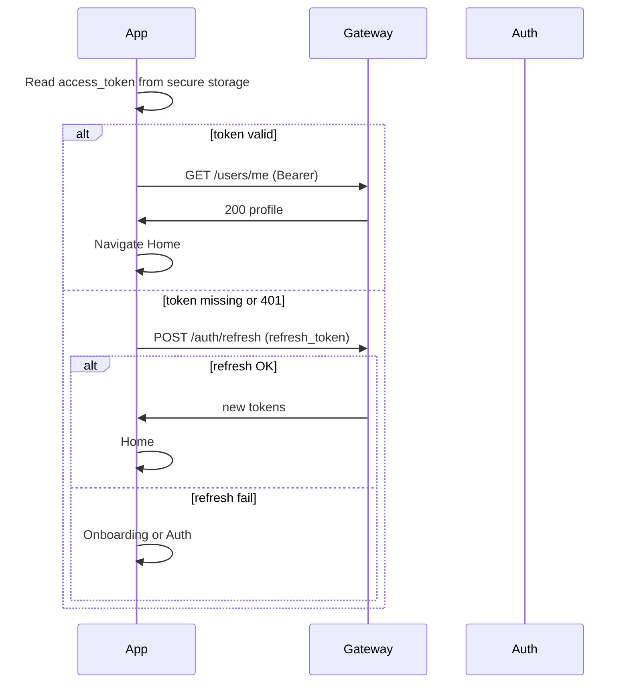

# Integration Contract — Frontend ↔ Backend

**Single source of truth** for how the Flutter app (`vithey_app/`) talks to the Spring Boot gateway (`backend/`).  
All AI prompts, screen docs, and service prompts must match this file.

## Repos (this monorepo)

| Output folder | Stack | Entry prompt |
| --- | --- | --- |
| `vithey_app/` | Flutter + GetX + Dio | `Prompt Frontend/KICKOFF_PROMPT.md` |
| `backend/` | Spring Boot microservices | `Prompt Backend/KICKOFF_PROMPT.md` |
| `backend/infrastructure/` + `backend/services/*/docker-compose.yml` | Per-service Docker | `Prompt Devops/DOCKER.md` |

Paths: `_shared/REPO_PATHS.md` · Ports: `_shared/SERVICE_REGISTRY.md`

**App name:** Vithey App · **Competition package name:** `aub_connect_app` (set in `pubspec.yaml` `name:` field; repo folder is `vithey_app/`).

## Network

| Item | Value |
|------|-------|
| Gateway (local) | `http://localhost:8080` |
| API base (Flutter `.env`) | `API_BASE_URL=http://localhost:8080/api/v1` |
| Android emulator | `http://10.0.2.2:8080/api/v1` |
| iOS simulator | `http://localhost:8080/api/v1` |
| Auth header | `Authorization: Bearer <access_token>` |
| Request ID | `X-Request-ID` (optional, generated by app) |

### Path convention in docs

- **Flutter `api_endpoints.dart`:** paths **relative to** `API_BASE_URL` — e.g. `/auth/login` (no `/api/v1` prefix).
- **Backend controllers & screen docs:** full paths — e.g. `/api/v1/auth/login`.
- **Both refer to the same endpoint.**

## Response envelope (all services)

**Success (single):** `{ "data": { ... } }`  
**Success (list):** `{ "data": [ ... ], "meta": { "page", "limit", "total", "total_pages" } }`  
**Error:** `{ "error": { "code", "message", "details": [{ "field", "message" }] } }`

**JSON field names:** `snake_case` everywhere in API JSON.

## Auth flow (Splash → Home)

| Step | Flutter | Backend |
|------|---------|---------|
| Register | `AuthRepository.register` → save tokens | `POST /api/v1/auth/register` → 201 |
| Login | `AuthRepository.login` → save tokens | `POST /api/v1/auth/login` → 200 |
| Refresh | Dio interceptor on 401 | `POST /api/v1/auth/refresh` |
| Logout | Clear storage + `POST /auth/logout` | `POST /api/v1/auth/logout` → 204 |
| Student verify | `StudentVerificationRepository` | `POST /api/v1/students/verify` (auth-service) |

**JWT claims:** `sub` (userId), `email`, `roles[]` · Access TTL 15 min · Refresh 7 days.

**Roles:** `USER`, `STUDENT`, `COMPANY`, `ADMIN` — finance requires `STUDENT`.

## Gateway routing (critical — order matters)

Spring Cloud Gateway must evaluate **specific routes before wildcards** to avoid sending social/CV traffic to user-profile-service.

| Order | Path pattern | Target service |
|-------|--------------|----------------|
| 0 | `/api/v1/auth/**` | auth-service |
| 0 | `/api/v1/users/me/cv` | career-service |
| 0 | `/api/v1/users/me/cv/**` | career-service |
| 0 | `/api/v1/users/*/follow` | content-service |
| 0 | `/api/v1/users/*/followers` | content-service |
| 0 | `/api/v1/users/*/following` | content-service |
| 0 | `/api/v1/files/**` | file-service |
| 0 | `/api/v1/posts/**` | content-service |
| 0 | `/api/v1/comments/**` | content-service |
| 0 | `/api/v1/reactions/**` | content-service |
| 0 | `/api/v1/follows/**` | content-service |
| 0 | `/api/v1/job-applications/**` | career-service |
| 0 | `/api/v1/places/**` | map-service |
| 0 | `/api/v1/fees/**` | finance-service |
| 0 | `/api/v1/payments/**` | finance-service |
| 0 | `/api/v1/students/verify` | auth-service |
| 0 | `/api/v1/conversations/**` | chat-service |
| 0 | `/api/v1/messages/**` | chat-service |
| 0 | `/api/v1/message-requests/**` | chat-service |
| 0 | `/api/v1/users/*/posts` | content-service |
| 0 | `/api/v1/users/*/report` | chat-service |
| 0 | `/api/v1/notifications/**` | notification-service |
| 0 | `/api/v1/ai/**` | ai-service |
| 1 | `/api/v1/users/**` | user-profile-service |

Public (no JWT): `/api/v1/auth/register`, `/api/v1/auth/login`, `/api/v1/auth/refresh`, `/api/v1/auth/forgot-password`, `/api/v1/auth/reset-password`, `/actuator/health`.

## Screen → service → endpoints

| Screen | Services | Primary endpoints (relative to base URL) |
|--------|----------|------------------------------------------|
| Splash | — | Local token check only |
| Onboarding | — | `shared_preferences` only |
| Auth | auth | `POST /auth/register`, `POST /auth/login` |
| Home | content | `GET /posts`, `POST /posts/{id}/reactions`, `POST /users/{id}/follow` |
| Create Post | file, content | `POST /files/upload`, `POST /posts` |
| Post Detail | content | `GET /posts/{id}`, `GET/POST /posts/{id}/comments`, `DELETE /posts/{id}/comments/{commentId}`, reactions, follow |
| Apply CV | file, career | `POST /files/upload` (type=CV), `POST /job-applications` |
| Preview CV | career, file | `GET /users/me/cv`, `GET /files/{id}/download` |
| Profile | user-profile, content | `GET /users/{id}`, user posts via content |
| Finance | finance | `GET /payments`, `GET /payments/alerts`, `GET /fees` — **403 if not STUDENT** |
| Student Verification | auth | `POST /students/verify` |
| Chat | chat | `GET /conversations`, `GET /message-requests`, `POST /conversations/{id}/accept` — see `Screen prompt/chat/README.md` |
| Chat Detail | chat | `GET/POST /conversations/{id}/messages`, `PATCH /messages/{id}/read`, STOMP `/ws` — see `Screen prompt/chat/05.chat_api_realtime.md` |
| AI Chatbot | ai | `POST /ai/chat`, `POST /ai/chat/stream`, `POST /ai/messages/{id}/regenerate`, `DELETE /ai/chat/requests/{id}`, `GET /ai/sessions`, `GET /ai/sessions/{id}/messages`, `DELETE /ai/sessions/{id}` — see `Screen prompt/chatbot/05.chatbot_api_streaming.md` |
| Notification | notification | `GET /notifications?is_read=`, `GET /notifications/unread-count`, `PATCH /notifications/{id}/read`, `PATCH /notifications/read-all`, `DELETE /notifications/{id}`, `POST /notifications/devices` |
| Search | user-profile, content | `GET /users/search?search=&page=&limit=`, `GET /posts?search=&type=&page=&limit=` — see `Screen prompt/search/README.md` |
| Settings | user-profile, auth | `GET/PATCH /users/me/settings`, `PATCH /auth/me/password`, `POST /auth/logout` |
| Applicant CV Preview | career, file | `GET /job-applications?job_post_id=`, `GET /job-applications/{id}/cv-preview`, `GET /files/{id}/download` |
| Map | map-service | `GET /places/nearby`, `GET /places/search`, `GET /places/autocomplete`, `GET /places/{id}`, `GET/POST /places/favorites`, `DELETE /places/favorites/{id}`, `GET/DELETE /places/history` — see `Prompt Backend/services/map-service/API_ENDPOINTS.md` |

## Cross-service flows

### Create post with media

1. `POST /files/upload` (type `POSTER` or `VIDEO`) → `file_id`, `url`
2. `POST /posts` with `{ type, content, media_file_id }`
3. Content publishes `post.created` → Notification

### Apply to job

1. `POST /files/upload` (type `CV`) → `file_id`
2. `PUT /users/me/cv` (career-service) — optional default CV
3. `POST /job-applications` with `{ job_post_id, cv_file_id }`
4. Career publishes `job.application.submitted` → Notification

### Map nearby shops

1. Flutter gets GPS or a picked search center (`lat` / `lng`)
2. `GET /places/nearby` (and `/search`, `/autocomplete`) on **map-service** — server calls Google Places; app never sees `GOOGLE_PLACES_API_KEY`
3. Markers + list use the same `places[]` payload
4. Pin tap → `GET /places/{id}`; heart → `/places/favorites`

### Student → Finance gate

1. `POST /students/verify` → role `STUDENT`, `is_student_verified: true`
2. Auth publishes `student.verified` → Finance creates/links student record
3. Finance screens call `GET /payments` — return 403 until verified

### Real-time chat (Telegram / Messenger — Flutter)

Full Flutter spec: `Prompt Frontend/Screen prompt/chat/README.md`

| Layer | Technology |
|-------|------------|
| REST | Dio → `GET /conversations`, `GET/POST /conversations/{id}/messages`, `PATCH /messages/{id}/read` |
| WebSocket | `web_socket_channel` + STOMP at gateway `wss://{host}/ws` |
| Subscribe | `/user/queue/messages` (filter by `conversation_id` in payload) |
| Send | `/app/chat.send` with `{ conversation_id, text, client_message_id }` |
| Offline | Isar local cache — conversations, messages, send outbox |
| Push | Firebase Messaging → tap opens `ChatDetailArgs(conversationId)` |

**API alias mapping** (simplified names → Vithey):

| Simplified | Vithey canonical |
|------------|------------------|
| `GET /chats` | `GET /conversations` |
| `GET /messages/{conversationId}` | `GET /conversations/{id}/messages` |
| `POST /messages/read` | `PATCH /messages/{id}/read` (batch endpoint planned) |
| `ws://server/chat/{id}` | `ws://{gateway}/ws` + STOMP user queue |

- Message requests: `POST /conversations/request`, list via `GET /message-requests`

### Global search (Facebook-style)

Full spec: `Screen prompt/search/README.md`

| Item | Contract |
|------|----------|
| People | `GET /users/search?search={q}&page=&limit=` (user-profile-service) |
| Posts / Jobs / Videos | `GET /posts?search={q}&type=&page=&limit=` (content-service — `search` param required extension) |
| Recent history | Device-local only via `SearchRecentStore` (shared_preferences); cleared on logout |
| Entry | Home app bar search icon → `AppRoutes.search` |
| Debounce | 350ms; min query length 2 before API |

### Push notifications

Full spec: `Screen prompt/notification/README.md` → `03` (FCM) + `05` (backend).

| Item | Contract |
|------|----------|
| Event source | RabbitMQ — `reaction.added`, `comment.added`, `follow.created`, `post.shared`, `chat.message.sent`, `job.application.*`, `payment.*`, `ai.response.ready`, `system.announcement` |
| FCM token | `POST /notifications/devices` `{ fcm_token, platform }` |
| In-app inbox | `GET /notifications?page&limit&is_read=` — response includes `actor`, `destination`, `event` |
| Unread badge | `GET /notifications/unread-count` |
| Mark read | `PATCH /notifications/{id}/read` |
| Delete | `DELETE /notifications/{id}` |
| Backend spec | `Prompt Backend/services/notification-service/UPGRADE_FOR_UI.md` |
| Chat realtime | WebSocket STOMP (chat-service) — separate from FCM; FCM when app backgrounded |
| Flutter | `firebase_messaging` receive + `flutter_local_notifications` tray + `NotificationRouter` deep link |

## Flutter integration checklist

- [ ] `api_endpoints.dart` matches this contract
- [ ] Dio interceptor: attach Bearer, refresh on 401 once, then logout
- [ ] Repositories per domain (auth, post, profile, cv, finance, chat, chatbot, notification, search, **places**)
- [ ] `USE_MOCK_AUTH` / mock repos for UI-only dev; swap to real repos when gateway is up
- [ ] Multipart upload via `UploadService` for files
- [ ] Pagination: pass `page`, `limit`; read `meta.total_pages` in controllers

## Backend integration checklist

- [ ] Infrastructure up: Eureka, Config, Postgres, Redis, RabbitMQ, MinIO
- [ ] Gateway routes in order above
- [ ] Each service registered in Eureka and reachable via gateway
- [ ] Auth issues JWT; gateway forwards `X-User-Id`, `X-User-Roles`
- [ ] Events wired per `Prompt Backend/COMMON_CONTEXT.md` event table

## Known gaps to fix during implementation

| Gap | Resolution |
|-----|------------|
| **map-service Java** | Run `Prompt Backend/run-complete/01-create-map-service.md` — prompts exist, no `backend/services/map-service/` yet |
| Flutter Map still uses Photon | After map-service exists, run frontend `run-glm-flash/02-map-google-location.md` |
| Auth / comments / notifications / CV preview / AI extras | Run `Prompt Backend/run-complete/02-upgrade-existing-services.md` |
| Gateway + DevOps + Postman sync | Run `Prompt Backend/run-complete/03-wire-gateway-contract-devops.md` |
| WebSocket URL | `wss://{API_HOST}/ws` — STOMP via `web_socket_channel`; see `Screen prompt/chat/05.chat_api_realtime.md` |
| FCM | Requires Firebase project + `google-services.json` / `GoogleService-Info.plist` |
| Google sign-in | Flutter coming soon — **do not** implement OAuth on backend yet |
| Startup skills/interests | Local Flutter only — **do not** invent a backend API |
| AI provider | Java stub now; optional Python: `Prompt Backend/services/ai-service/INTEGRATION.md` |
